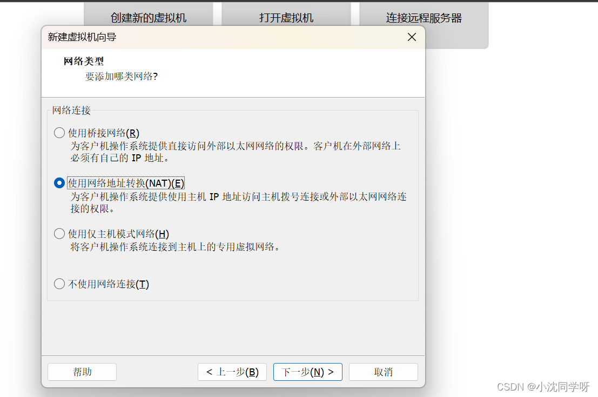
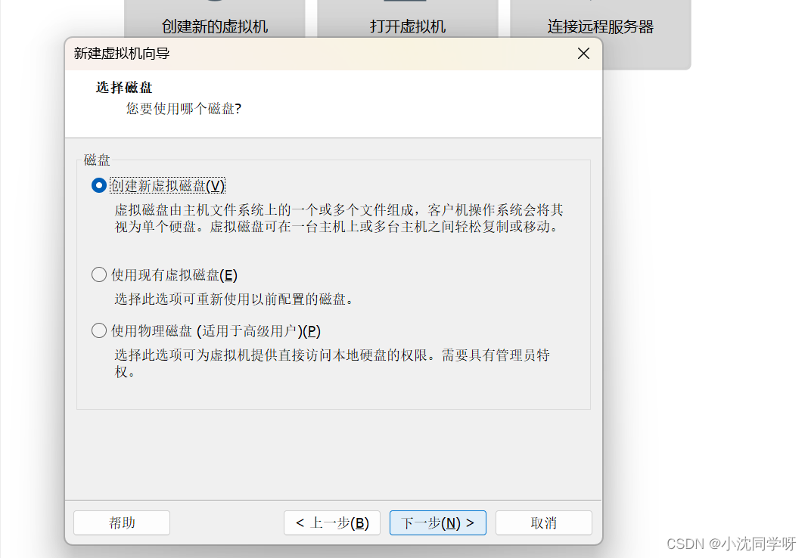
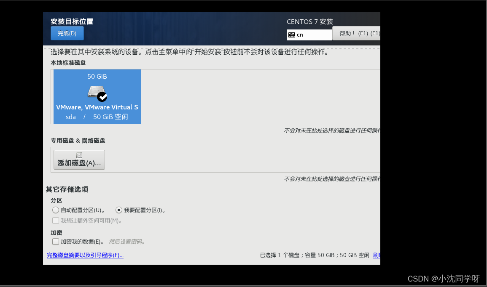

# 第3节：准备工作：VMware17PRO及centos安装

#### 文章目录

[TOC]

### 前言

很早之前就想分享一期关于虚拟机的博文，苦恼的是一直没有找到机会。这不最近我个人的阿里云服务器到期了，自己又不想续费，主要是太贵了。那么，现在就在本地电脑上安装个VMware17虚拟机吧，然后再安装一个Centos7系统，这不又可以愉快的玩耍了。

### 技术积累

[VMware](https://so.csdn.net/so/search?q=VMware&spm=1001.2101.3001.7020)

> VMware（威睿） 是全球桌面到数据中心虚拟化解决方案的领导厂商。全球不同规模的客户依靠VMware来降低成本和运营费用、确保业务持续性、加强安全性并走向绿色。VMware使企业可以采用能够解决其独有业务难题的云计算模式。

> 在Windows系统中按照VMware软件，我们可以在VMware中虚拟化出各种的服务器资源，在测试软件或者想要使用其他系统的场景下还是挺方便的。

CentOS

> CentOS（Community Enterprise Operating System，中文意思是社区企业操作系统）是Linux发行版之一，是免费的、开源的、可以重新分发的开源操作系统 。

> CentOS Linux发行版是一个稳定的，可预测的，可管理的和可复现的平台，源于Red Hat Enterprise Linux（RHEL）依照开放源代码（大部分是GPL开源协议 ）规定释出的源码所编译而成。

一般情况下我们的软件项目都会放在Linux系统部署，其主要原因是它的安全性较高。

### 1. [VMware虚拟机](https://so.csdn.net/so/search?q=VMware%E8%99%9A%E6%8B%9F%E6%9C%BA&spm=1001.2101.3001.7020)的安装

#### 下载VMware安装文件

进入官网的 VMware Workstation Pro 页面，浏览功能特性、应用场景、系统要求等。下滑页面点击 试用 Workstation 17Pro 下方的下载链接，跳转至下载页面。  


在下载页面中下滑，根据操作系统选择合适的产品，在这里以 Windows11 系统为例，选择 Workstation 17 Pro for Windows，开始下载安装文件。

#### VMware安装步骤

选择执行安装文件  
在我们下载好的文件夹中找到安装文件，双击，等待安装程序运行。  


#### VMware配置密匙

MC60H-DWHD5-H80U9-6V85M-8280D（亲测有效）  
JUO9O-6039P-08409-8J0QH-2YR7F  
4A4RR-813DK-M81A9-4U35H-06KND  
NZ4RR-FTK5H-H81C1-Q30QH-1V2LA  
JU090-6039P-08409-8J0QH-2YR7F  
4Y09U-AJK97-089Z0-A3054-83KLA  
4C21U-2KK9Q-M8130-4V2QH-CF810  
MC60H-DWHD5-H80U9-6V85M-8280D  
ZA30U-DXF84-4850Q-UMMXZ-W6K8F  
AC590-2XW97-48EFZ-TZPQE-MYHEA  
YF39K-DLFE5-H856Z-6NWZE-XQ2XD  
AC15R-FNZ16-H8DWQ-WFPNV-M28E2  
CZ1J8-A0D82-489LZ-ZMZQT-P3KX6  
YA11K-6YE8H-H89ZZ-EXM59-Y6AR0

### 2. 虚拟机中安装centos7

#### 准备工作

笔者是在阿里云镜像站进行下载的，大家可以参考。  
centos-7-isos-x86\_64安装包下载\_开源镜像站-阿里云 (aliyun.com)  
1.软件：VMware Workstation 虚拟机  
2.镜像文件：CentOS-7-x86\_64-DVD-2009.iso  
https://mirrors.aliyun.com/centos/7/isos/x86\_64/CentOS-7-x86\_64-DVD-2009.iso

#### 创建虚拟机

##### 步骤1 自定义安装

打开VMware虚拟机，「文件 → 新建虚拟机 → 自定义 → 下一步」。  


##### 步骤2 硬盘兼容性

「硬盘兼容性」选择默认就可以，继续「下一步」。  


##### 步骤3 安装客户机操作系统

进入 「客户机操作系统」 选择 「稍后安装操作系统」 （因为tfwf要在虚拟机安装完成之后，把不需要的硬件删除，所以选择稍后安装操作系统）。  


##### 步骤4 选择客户机操作系统

选择客户端操作系统：「客户机操作系统 → Linux」→ 版本选 「CentOS 7 64位」 → 「下一步」，注意：版本一定要对应镜像文件版本。  


##### 步骤5 命名虚拟机

命名虚拟机，位置（D:\\vm\\sefel-test），这样可以在 「vm」，文件夹放多个操作系统。


##### 步骤6 处理器配置

「处理器配置」，可以根据您的系统选择。这里大家可以打开自己的任务管理器查看自己的电脑的配置。  


这里以笔者的电脑为例，12核20个处理器，这里虚拟机的「处理器的数量和每个处理器的核数」 相乘不可以超过自己电脑的逻辑处理器数。  


##### 步骤7 设置虚拟机内存

笔者这里设置为4096也就是4个G，大家测试学习的话，其实两个G就够了。


##### 步骤8 设置虚拟机网络类型

网络类型 → NAT模式（可以使虚拟机与主机使用同一网络）  


##### 步骤9 选择I/O控制器类型

这里默认即可

  
  


##### 步骤10 指定磁盘容量

磁盘容量一般20G就够了，因为笔者后面需要装的东西比较多，这里给了50G，大家适量给就可以了。  


##### 步骤11 指定磁盘文件

指定磁盘文件（.vmdk）文件  


##### 步骤12 虚拟机数据参数

这样虚拟机差不多就准备好了，接下来删除一些不需要的硬件。  


##### 步骤13 自定义硬件

自定义硬件 → 移除 「USB控制器、声卡」（这样可以让虚拟器启动的快一点）。  


至此，虚拟机中的硬件已经搭建完成。

#### CentOS7系统镜像安装

##### 步骤1 选择CI/DVD安装

点击 「CD/DVD（IDE）」  


##### 步骤2 选择下载的ISO镜像

在连接处选择 \*\*使用ISO映像文件 \*\*选择CentOS 7 iso文件，确定。  


##### 步骤3 开启虚拟机

「开始安装虚拟机」，进入CentOS安装界面。  


##### 步骤4 选择安装CentOS7系统

按方向键选择第一项 Install CentOS 7，按回车Enter键  


##### 步骤5 设置语言

CentOS欢迎界面，WELCOME TO CENTOS 7. 设置语言为中文简体。  


##### 步骤6 设置时区

设置时区–DATE & TIME  


##### 步骤7 安装软件选择

「软件选择最小安装即可」  


如果有需要也可以选择「GNOME桌面」，这里会有一个UI界面。

##### 步骤8 系统分区

安装位置即进行系统分区  
选中我们在创建虚拟机时候的50G虚拟硬盘，点击我要配置分区  


以下是笔者分区的配置，可以参考一下。  


##### 步骤9 网络配置

打开网络配置以及修改主机名。  


「到这里就可以点击开始安装了」  


##### 步骤10 配置系统用户

配置系统用户  


##### 步骤11 重启虚拟机

部署完成后，点击重启 重启虚拟机。  


##### 步骤12 启动虚拟机登入

重启虚拟机输入用户名和密码进行验证  


由上图所示，我们已经用VMware虚拟化出了一个CentOS7系统。

### 3. 虚拟机网络接入模式

#### NAT 网络地址转换模式(NAT,Network Address Translation)

> NAT模式是最简单的实现虚拟机上网的方式，你可以这样理解：Vhost访问网络的所有数据都是由主机提供的，vhost并不真实存在于网络中，主机与网络中的任何机器都不能查看和访问到Vhost的存在。
>
> -   **虚拟机与主机关系:**  
>     只能单向访问，虚拟机可以通过网络访问到主机，主机无法通过网络访问到虚拟机。
> -   **虚拟机与网络中其他主机的关系:**  
>     只能单向访问，虚拟机可以访问到网络中其他主机，其他主机不能通过网络访问到虚拟机。
> -   **虚拟机与虚拟机之间的关系：**  
>     相互不能访问，虚拟机与虚拟机各自完全独立，相互间无法通过网络访问彼此。
>
> > IP:10.0.2.15  
> > 网关：10.0.2.2  
> > DNS：10.0.2.3  
> > 一台虚拟机的多个网卡可以被设定使用 NAT， 第一个网卡连接了到专用网 10.0.2.0，第二个网卡连接到专用网络 10.0.3.0，等等。默认得到的客户端ip（IP Address）是10.0.2.15，网关（Gateway）是10.0.2.2，域名服务器（DNS）是10.0.2.3，可以手动参考这个进行修改。

> NAT方案优缺点：  
> 笔记本已插网线时： 虚拟机可以访问主机，虚拟机可以访问互联网，在做了端口映射后（最后有说明），主机可以访问虚拟机上的服务（如数据库）。  
> 笔记本没插网线时： 主机的“本地连接”有红叉的，虚拟机可以访问主机，虚拟机不可以访问互联网，在做了端口映射后，主机可以访问虚拟机上的服务（如数据库）。

#### Bridged Adapter 桥接模式

> -   **虚拟机与主机关系：**  
>     可以相互访问，因为虚拟机在真实网络段中有独立IP，主机与虚拟机处于同一网络段中，彼此可以通过各自IP相互访问。
> -   **虚拟机于网络中其他主机关系：**  
>     可以相互访问，同样因为虚拟机在真实网络段中有独立IP，虚拟机与所有网络其他主机处于同一网络段中，彼此可以通过各自IP相互访问。
> -   **虚拟机于虚拟机关系：**  
>     可以相互访问，原因同上。
>
> > IP：一般是[DHCP](https://so.csdn.net/so/search?q=DHCP&spm=1001.2101.3001.7020)分配的，与主机的“本地连接”的IP 是同一网段的。虚拟机就能与主机互相通信。  
> > 笔记本已插网线时：（若网络中有[DHCP服务器](https://so.csdn.net/so/search?q=DHCP%E6%9C%8D%E5%8A%A1%E5%99%A8&spm=1001.2101.3001.7020)）主机与虚拟机会通过DHCP分别得到一个IP，这两个IP在同一网段。 主机与虚拟机可以ping通，虚拟机可以上互联网。  
> > 笔记本没插网线时：主机与虚拟机不能通信。主机的“本地连接”有红叉，就不能手工指定IP。虚拟机也不能通过DHCP得到IP地址，手工指定IP后，也无法与主机通信，因为主机无IP。  
> > 这时主机的VirtualBox Host-Only Network 网卡是有ip的，192.168.56.1。虚拟机就算手工指定了IP 192.168.56.\*，也ping不能主机。

#### Internal 内部网络模式

> -   **虚拟机与主机关系：**  
>     不能相互访问，彼此不属于同一个网络，无法相互访问。
> -   **虚拟机于网络中其他主机关系：**  
>     不能相互访问，理由同上。
> -   **虚拟机于虚拟机关系：**  
>     可以相互访问，前提是在设置网络时，两台虚拟机设置同一网络名称。如上配置图中，名称为intnet。  
>     IP: VirtualBox的DHCP服务器会为它分配IP ，一般得到的是192.168.56.101，因为是从101起分的，也可手工指定192.168.56.\*。  
>     笔记本已插网线时：虚拟机可以与主机的VirtualBox Host-Only Network 网卡通信  
>     这种方案不受主机本地连接（网卡）是否有红叉的影响。

#### Host-only Adapter模式

> 主机模式，这是一种比较复杂的模式，需要有比较扎实的网络基础知识才能玩转。可以说前面几种模式所实现的功能，在这种模式下，通过虚拟机及网卡的设置都可以被实现。 我们可以理解为Vbox在主机中模拟出一张专供虚拟机使用的网卡，所有虚拟机都是连接到该网卡上的，我们可以通过设置这张网卡来实现上网及其他很多功能，比如（网卡共享、网卡桥接等）。
>
> -   **虚拟机与主机关系：**  
>     默认不能相互访问，双方不属于同一IP段，host-only网卡默认IP段为192.168.56.X 子网掩码为255.255.255.0，后面的虚拟机被分配到的也都是这个网段。通过网卡共享、网卡桥接等，可以实现虚拟机于主机相互访问。
> -   **虚拟机于网络中其他主机关系：**  
>     默认不能相互访问，原因同上，通过设置，可以实现相互访问。
> -   **虚拟机于虚拟机关系：**  
>     默认可以相互访问，都是同处于一个网段。  
>     虚拟机访问主机 用的是主机的VirtualBox Host-Only Network网卡的IP：192.168.56.1 ，不管主机“本地连接”有无红叉，永远通。  
>     主机访问虚拟机，用是的虚拟机的网卡3的IP： 192.168.56.101 ，不管主机“本地连接”有无红叉，永远通。  
>     虚拟机访问互联网，用的是自己的网卡2， 这时主机要能通过“本地连接”有线上网，（无线网卡不行）

### 4. Centos7网络配置

#### Centos7静态网络配置文件路径：

使用命令编辑

```sh
[root@localhost ~]# cd /etc/sysconfig/network-scripts/
[root@localhost network-scripts]# ls
ifcfg-ens33  ifdown-eth   ifdown-post    ifdown-Team      ifup-aliases  ifup-ipv6   ifup-post    ifup-Team      init.ipv6-global
ifcfg-lo     ifdown-ippp  ifdown-ppp     ifdown-TeamPort  ifup-bnep     ifup-isdn   ifup-ppp     ifup-TeamPort  network-functions
ifdown       ifdown-ipv6  ifdown-routes  ifdown-tunnel    ifup-eth      ifup-plip   ifup-routes  ifup-tunnel    network-functions-ipv6
ifdown-bnep  ifdown-isdn  ifdown-sit     ifup             ifup-ippp     ifup-plusb  ifup-sit     ifup-wireless
[root@localhost network-scripts]# pwd
/etc/sysconfig/network-scripts
[root@localhost network-scripts]# 
```

```bash
[root@localhost network-scripts]# vi ifcfg-ens33 
```

原始配置文件

```sh
TYPE="Ethernet"
PROXY_METHOD="none"
BROWSER_ONLY="no"
BOOTPROTO="dhcp"
DEFROUTE="yes"
IPV4_FAILURE_FATAL="no"
IPV6INIT="yes"
IPV6_AUTOCONF="yes"
IPV6_DEFROUTE="yes"
IPV6_FAILURE_FATAL="no"
IPV6_ADDR_GEN_MODE="stable-privacy"
NAME="ens33"
UUID="bf761048-4836-4742-b935-3b74a14e9589"
DEVICE="ens33"
ONBOOT="yes"
```

静态网络配置文件文件内容如下：

```sh
TYPE="Ethernet"
PROXY_METHOD="none"
BROWSER_ONLY="no"
BOOTPROTO="static"
DEFROUTE="yes"
IPV4_FAILURE_FATAL="no"
IPV6INIT="yes"
IPV6_AUTOCONF="yes"
IPV6_DEFROUTE="yes"
IPV6_FAILURE_FATAL="no"
IPV6_ADDR_GEN_MODE="stable-privacy"
NAME="ens33"
UUID="bf761048-4836-4742-b935-3b74a14e9589"
DEVICE="ens33"
ONBOOT="yes"
IPADDR="192.168.160.128"
NETMASK="255.255.255.0"
GATEWAY="192.168.160.2"
```

> 主要修改文件的以下几个内容：
>
> ONBOOT=yes  
> BOOTPROTO=static  
> IPADDR=                           #静态IP，随意，与主机同一网段即可  
> NETMASK=255.255.255.0 #掩码,对应主机掩码  
> GATEWAY=                      #网关，对应主机的网关


#### 配置resolv.conf

resolv.conf这个文件内容不改的话。ping外网会提示 **ping: www.baidu.com: Name or service not known**，这里踩过坑

##### 修改resolv.conf的命令

> vi /etc/resolv.conf

vi进入resolv.conf文件后，**按i键**修改resolv.conf的内容如下

> nameserver 192.168.160.2 //域名服务器 ,不知道也可以设置成网关 也可是设置成 8.8.8.8


#### 设置selinux

selinux要设置成disabled

##### vi编辑selinux文件

> vi /etc/sysconfig/selinux


#### 重启网络服务

> ## systemctl restart network

或者

> ## systemctl restart network.service

#### 查看修改之后的IP

> ip addr

上面的ifcfg-enp0s3文件我做了修改,主要是找不到eth0文件，然后就干脆把原来的ifcfg-enp0s3名称该成了ifcfg-eth0

> mv /etc/sysconfig/network-scripts/ifcfg-enp0s3 /etc/sysconfig/network-scripts/ifcfg-eth0

### 5. yum配置

> **通知：CentOS 8操作系统版本结束了生命周期（EOL），Linux社区已不再维护该操作系统版本。建议您切换到Anolis或Alinux。如果您的业务过渡期仍需要使用CentOS 8系统中的一些安装包，请根据下文切换CentOS 8的源。**

### 1\. 备份

```sh
mv /etc/yum.repos.d/CentOS-Base.repo /etc/yum.repos.d/CentOS-Base.repo.backup
```

### 2\. 下载新的 CentOS-Base.repo 到 /etc/yum.repos.d/

##### centos8（centos8官方源已下线，建议切换centos-vault源）

```sh
wget -O /etc/yum.repos.d/CentOS-Base.repo https://mirrors.aliyun.com/repo/Centos-vault-8.5.2111.repo

```

或者

```
curl -o /etc/yum.repos.d/CentOS-Base.repo https://mirrors.aliyun.com/repo/Centos-vault-8.5.2111.repo

```

**centos6（centos6官方源已下线，建议切换centos-vault源）**

```
wget -O /etc/yum.repos.d/CentOS-Base.repo https://mirrors.aliyun.com/repo/Centos-vault-6.10.repo

```

或者

```
curl -o /etc/yum.repos.d/CentOS-Base.repo https://mirrors.aliyun.com/repo/Centos-vault-6.10.repo

```

**CentOS 7**

```
wget -O /etc/yum.repos.d/CentOS-Base.repo https://mirrors.aliyun.com/repo/Centos-7.repo

```

或者

```
curl -o /etc/yum.repos.d/CentOS-Base.repo https://mirrors.aliyun.com/repo/Centos-7.repo
curl -O /etc/yum.repos.d/CentOS-Base.repo http://mirrors.163.com/.help/CentOS7-Base-163.repo

```

```sh

# CentOS-Base.repo
#
# The mirror system uses the connecting IP address of the client and the
# update status of each mirror to pick mirrors that are updated to and
# geographically close to the client.  You should use this for CentOS updates
# unless you are manually picking other mirrors.
#
# If the mirrorlist= does not work for you, as a fall back you can try the 
# remarked out baseurl= line instead.
#
#
 
[base]
name=CentOS-$releasever - Base - mirrors.aliyun.com
failovermethod=priority
baseurl=http://mirrors.aliyun.com/centos/$releasever/os/$basearch/
        http://mirrors.aliyuncs.com/centos/$releasever/os/$basearch/
        http://mirrors.cloud.aliyuncs.com/centos/$releasever/os/$basearch/
gpgcheck=1
gpgkey=http://mirrors.aliyun.com/centos/RPM-GPG-KEY-CentOS-7
 
#released updates 
[updates]
name=CentOS-$releasever - Updates - mirrors.aliyun.com
failovermethod=priority
baseurl=http://mirrors.aliyun.com/centos/$releasever/updates/$basearch/
        http://mirrors.aliyuncs.com/centos/$releasever/updates/$basearch/
        http://mirrors.cloud.aliyuncs.com/centos/$releasever/updates/$basearch/
gpgcheck=1
gpgkey=http://mirrors.aliyun.com/centos/RPM-GPG-KEY-CentOS-7
 
#additional packages that may be useful
[extras]
name=CentOS-$releasever - Extras - mirrors.aliyun.com
failovermethod=priority
baseurl=http://mirrors.aliyun.com/centos/$releasever/extras/$basearch/
        http://mirrors.aliyuncs.com/centos/$releasever/extras/$basearch/
        http://mirrors.cloud.aliyuncs.com/centos/$releasever/extras/$basearch/
gpgcheck=1
gpgkey=http://mirrors.aliyun.com/centos/RPM-GPG-KEY-CentOS-7
 
#additional packages that extend functionality of existing packages
[centosplus]
name=CentOS-$releasever - Plus - mirrors.aliyun.com
failovermethod=priority
baseurl=http://mirrors.aliyun.com/centos/$releasever/centosplus/$basearch/
        http://mirrors.aliyuncs.com/centos/$releasever/centosplus/$basearch/
        http://mirrors.cloud.aliyuncs.com/centos/$releasever/centosplus/$basearch/
gpgcheck=1
enabled=0
gpgkey=http://mirrors.aliyun.com/centos/RPM-GPG-KEY-CentOS-7
 
#contrib - packages by Centos Users
[contrib]
name=CentOS-$releasever - Contrib - mirrors.aliyun.com
failovermethod=priority
baseurl=http://mirrors.aliyun.com/centos/$releasever/contrib/$basearch/
        http://mirrors.aliyuncs.com/centos/$releasever/contrib/$basearch/
        http://mirrors.cloud.aliyuncs.com/centos/$releasever/contrib/$basearch/
gpgcheck=1
enabled=0
gpgkey=http://mirrors.aliyun.com/centos/RPM-GPG-KEY-CentOS-7
```

 epel.repo

```sh
[epel]
name=Extra Packages for Enterprise Linux 7 - $basearch
baseurl=http://mirrors.aliyun.com/epel/7/$basearch
failovermethod=priority
enabled=1
gpgcheck=1
gpgkey=http://mirrors.aliyun.com/epel/RPM-GPG-KEY-EPEL-7
 
[epel-debuginfo]
name=Extra Packages for Enterprise Linux 7 - $basearch - Debug
baseurl=http://mirrors.aliyun.com/epel/7/$basearch/debug
failovermethod=priority
enabled=0
gpgcheck=1
gpgkey=http://mirrors.aliyun.com/epel/RPM-GPG-KEY-EPEL-7
 
[epel-source]
name=Extra Packages for Enterprise Linux 7 - $basearch - Source
baseurl=http://mirrors.aliyun.com/epel/7/SRPMS
failovermethod=priority
enabled=0
gpgcheck=1
gpgkey=http://mirrors.aliyun.com/epel/RPM-GPG-KEY-EPEL-7

```


### 3\. 运行 yum makecache 生成缓存

### 4\. 其他

非阿里云ECS用户会出现 Couldn't resolve host 'mirrors.cloud.aliyuncs.com' 信息，不影响使用。用户也可自行修改相关配置: eg:

```
sed -i -e '/mirrors.cloud.aliyuncs.com/d' -e '/mirrors.aliyuncs.com/d' /etc/yum.repos.d/CentOS-Base.repo
