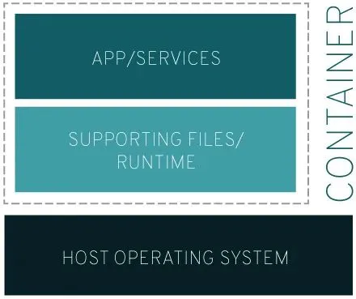
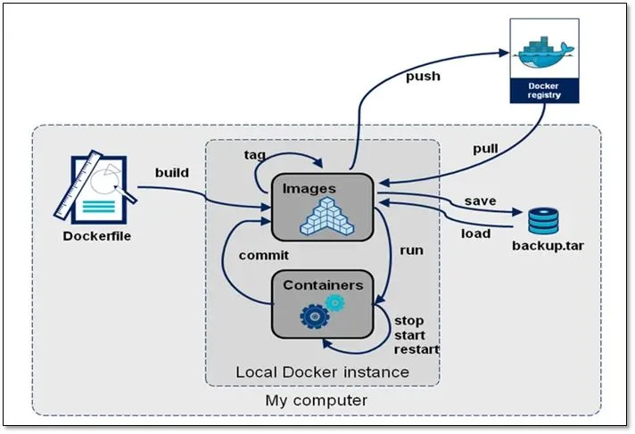

> 

[TOC]

## 1 容器简介

### 1.1 什么是 Linux 容器

Linux容器是与系统其他部分隔离开的一系列进程，从另一个镜像运行，并由该镜像提供支持进程所需的全部文件。容器提供的镜像包含了应用的所有依赖项，因而在从开发到测试再到生产的整个过程中，它都具有可移植性和一致性。



> -   更加详细地来说，请您假定您在开发一个应用。您使用的是一台笔记本电脑，而且您的开发环境具有特定的配置。其他开发人员身处的环境配置可能稍有不同。您正在开发的应用依赖于您当前的配置，还要依赖于某些特定文件。与此同时，您的企业还拥有标准化的测试和生产环境，且具有自身的配置和一系列支持文件。您希望尽可能多在本地模拟这些环境，而不产生重新创建服务器环境的开销。
>
> -   因此，您要如何确保应用能够在这些环境中运行和通过质量检测，并且在部署过程中不出现令人头疼的问题，也无需重新编写代码和进行故障修复？答案就是使用容器。容器可以确保您的应用拥有必需的配置和文件，使得这些应用能够在从开发到测试、再到生产的整个流程中顺利运行，而不出现任何不良问题。这样可以避免危机，做到皆大欢喜。
>

虽然这只是简化的示例，但在需要很高的可移植性、可配置性和隔离的情况下，我们可以利用 Linux 容器通过很多方式解决难题。无论基础架构是在企业内部还是在云端，或者混合使用两者，容器都能满足您的需求。

### 1.2 容器不就是虚拟化吗

是，但也不竟然。我们用一种简单方式来思考一下：

虚拟化使得许多操作系统可同时在单个系统上运行。

容器则可共享同一个操作系统内核，将应用进程与系统其他部分隔离开。

' fill='%23FFFFFF'%3E%3Crect x='249' y='126' width='1' height='1'%3E%3C/rect%3E%3C/g%3E%3C/g%3E%3C/svg%3E)

图-普通虚拟化技术和Docker的对比

这意味着什么？首先，让多个操作系统在单个虚拟机监控程序上运行以实现虚拟化，并不能达成和使用容器同等的轻量级效果。事实上，在仅拥有容量有限的有限资源时，您需要能够可以进行密集部署的轻量级应用。Linux 容器可从单个操作系统运行，在所有容器中共享该操作系统，因此应用和服务能够保持轻量级，并行快速运行。

### 1.3 容器发展简史

' fill='%23FFFFFF'%3E%3Crect x='249' y='126' width='1' height='1'%3E%3C/rect%3E%3C/g%3E%3C/g%3E%3C/svg%3E)

我们现在称为容器技术的概念最初出现在 2000 年，当时称为 FreeBSD jail，这种技术可将 FreeBSD 系统分区为多个子系统（也称为 Jail）。Jail 是作为安全环境而开发的，系统管理员可与企业内部或外部的多个用户共享这些 Jail。

Jail 的目的是让进程在经过修改的 _chroot_ 环境中创建，而不会脱离和影响整个系统 — 在 chroot 环境中，对文件系统、网络和用户的访问都实现了虚拟化。尽管 Jail 在实施方面存在局限性，但最终人们找到了脱离这种隔离环境的方法。

但这个概念非常有吸引力。

2001 年，通过 Jacques Gélinas 的 VServer 项目，隔离环境的实施进入了 Linux 领域。正如 Gélinas 所说，这项工作的目的是“在高度独立且安全的单一环境中运行多个通用 Linux 服务器 \[sic\]。” 在完成了这项针对 Linux 中多个受控制用户空间的基础性工作后，Linux 容器开始逐渐成形并最终发展成了现在的模样。

## 2 什么是 Docker？

“Docker” 一词指代多种事物，包括开源社区项目、开源项目使用的工具、主导支持此类项目的公司 Docker Inc. 以及该公司官方支持的工具。技术产品和公司使用同一名称，的确让人有点困惑。

我们来简单说明一下：

> -   IT 软件中所说的 “Docker” ，是指容器化技术，用于支持创建和使用 Linux 容器。
>
> -   开源 Docker 社区致力于改进这类技术，并免费提供给所有用户，使之获益。
>
> -   Docker Inc. 公司凭借 Docker 社区产品起家，它主要负责提升社区版本的安全性，并将改进后的版本与更广泛的技术社区分享。此外，它还专门对这些技术产品进行完善和安全固化，以服务于企业客户。
>

借助 Docker ，您可将容器当做重量轻、模块化的虚拟机使用。同时，您还将获得高度的灵活性，从而实现对容器的高效创建、部署及复制，并能将其从一个环境顺利迁移至另一个环境。

### 2.1 Docker 如何工作？

Docker 技术使用 Linux 内核和内核功能（例如 _Cgroups_ _和 namespaces_）来分隔进程，以便各进程相互独立运行。这种独立性正是采用容器的目的所在；它可以独立运行多种进程、多个应用程序，更加充分地发挥基础设施的作用，同时保持各个独立系统的安全性。

容器工具（包括 Docker）可提供基于镜像的部署模式。这使得它能够轻松跨多种环境，与其依赖程序共享应用或服务组。Docker 还可在这一容器环境中自动部署应用程序（或者合并多种流程，以构建单个应用程序）。

此外，由于这些工具基于 Linux 容器构建，使得 Docker 既易于使用，又别具一格 —— 它可为用户提供前所未有的高度应用程访问权限、快速部署以及版本控制和分发能力。

### 2.2 Docker 技术是否与传统的 Linux 容器相同？

否。Docker 技术最初是基于 LXC 技术构建（大多数人都会将这一技术与“传统的” Linux 容器联系在一起），但后来它逐渐摆脱了对这种技术的依赖。

就轻量级虚拟化这一功能来看，LXC 非常有用，但它无法提供出色的开发人员或用户体验。除了运行容器之外，Docker 技术还具备其他多项功能，包括简化用于构建容器、传输镜像以及控制镜像版本的流程。

' fill='%23FFFFFF'%3E%3Crect x='249' y='126' width='1' height='1'%3E%3C/rect%3E%3C/g%3E%3C/g%3E%3C/svg%3E)

传统的 Linux 容器使用 init 系统来管理多种进程。这意味着，所有应用程序都作为一个整体运行。与此相反，Docker 技术鼓励应用程序各自独立运行其进程，并提供相应工具以实现这一功能。这种精细化运作模式自有其优势。

### 2.3 docker的目标

docker的主要目标是"Build,Ship and Run any App,Angwhere",构建，运输，处处运行

**构建**：做一个docker镜像

**运输**：docker pull

**运行**：启动一个容器

每一个容器，他都有自己的文件系统rootfs.

## 3 安装Docker

环境说明:

```sh
# 需要两台几点进行安装
[root@localhost ~]# cat /etc/redhat-release
CentOS Linux release 7.9.2009 (Core)
[root@localhost ~]# uname  -r
3.10.0-1160.el7.x86_64
[root@localhost ~]# hostname -I
192.168.160.128 
[root@localhost ~]# 
```

在**两个节点**上都进行操作

```
[root@localhost yum.repos.d]# cat /etc/redhat-release
CentOS Linux release 7.9.2009 (Core)
[root@localhost yum.repos.d]#  uname  -r
3.10.0-1160.el7.x86_64
[root@localhost yum.repos.d]# hostname -I
192.168.160.129 
[root@localhost yum.repos.d]# 

```

### 3.0 docker安装

#### 3.0.1 使用官方安装脚本自动安装

```sh
curl -fsSL https://get.docker.com | bash -s docker --mirror Aliyun
```

#### 3.0.2 手动安装

- 卸载旧版本

较旧的 Docker 版本称为 docker 或 docker-engine 。如果已安装这些程序，请卸载它们以及相关的依赖项。

```sh
sudo yum remove docker \
                  docker-client \
                  docker-client-latest \
                  docker-common \
                  docker-latest \
                  docker-latest-logrotate \
                  docker-logrotate \
                  docker-engine
```

- 安装 Docker Engine-Community

使用 Docker 仓库进行安装

在新主机上首次安装 Docker Engine-Community 之前，需要设置 Docker 仓库。之后，您可以从仓库安装和更新 Docker。

**设置仓库**

安装所需的软件包。yum-utils 提供了 yum-config-manager ，并且 device mapper 存储驱动程序需要 device-mapper-persistent-data 和 lvm2。

``` sh
$ sudo yum install -y yum-utils
```

使用以下命令来设置稳定的仓库。

使用官方源地址（比较慢）

```sh
$ sudo yum-config-manager \
    --add-repo \
    https://download.docker.com/linux/centos/docker-ce.repo
```

阿里云

```sh
$ **sudo** yum-config-manager \
  --add-repo \
  https:**//**mirrors.aliyun.com**/**docker-ce**/**linux**/**centos**/**docker-ce.repo
```

清华大学源

```sh
$ **sudo** yum-config-manager \
  --add-repo \
  https:**//**mirrors.tuna.tsinghua.edu.cn**/**docker-ce**/**linux**/**centos**/**docker-ce.repo
```

- 安装 Docker Engine-Community

安装最新版本的 Docker Engine-Community 和 containerd，或者转到下一步安装特定版本：

```
$ sudo yum install docker-ce docker-ce-cli containerd.io docker-compose-plugin
```

如果提示您接受 GPG 密钥，请选是。

> **有多个 Docker 仓库吗？**
>
> 如果启用了多个 Docker 仓库，则在未在 yum install 或 yum update 命令中指定版本的情况下，进行的安装或更新将始终安装最高版本，这可能不适合您的稳定性需求。

Docker 安装完默认未启动。并且已经创建好 docker 用户组，但该用户组下没有用户。

**要安装特定版本的 Docker Engine-Community，请在存储库中列出可用版本，然后选择并安装：**

1、列出并排序您存储库中可用的版本。此示例按版本号（从高到低）对结果进行排序。


```sh 
$ yum list docker-ce --showduplicates | sort -r

docker-ce.x86_64  3:18.09.1-3.el7                     docker-ce-stable
docker-ce.x86_64  3:18.09.0-3.el7                     docker-ce-stable
docker-ce.x86_64  18.06.1.ce-3.el7                    docker-ce-stable
docker-ce.x86_64  18.06.0.ce-3.el7                    docker-ce-stable
```

2、通过其完整的软件包名称安装特定版本，该软件包名称是软件包名称（docker-ce）加上版本字符串（第二列），从第一个冒号（:）一直到第一个连字符，并用连字符（-）分隔。例如：docker-ce-18.09.1。

```
$ sudo yum install docker-ce-<VERSION_STRING> docker-ce-cli-<VERSION_STRING> containerd.io
```

启动 Docker。

```
$ sudo systemctl start docker
```

通过运行 hello-world 镜像来验证是否正确安装了 Docker Engine-Community 。

```
$ sudo docker run hello-world
```

### 卸载 docker

删除安装包：

```
yum remove docker-ce
```

删除镜像、容器、配置文件等内容：

```
rm -rf /var/lib/docker
```

### 3.1 Docker基础命令操作

查看docker相关信息

```sh
[root@localhost ~]# docker version
Client: Docker Engine - Community
 Version:           26.1.4
 API version:       1.45
 Go version:        go1.21.11
 Git commit:        5650f9b
 Built:             Wed Jun  5 11:32:04 2024
 OS/Arch:           linux/amd64
 Context:           default
Cannot connect to the Docker daemon at unix:///var/run/docker.sock. Is the docker daemon running?
[root@localhost ~]# 
```


```
[root@localhost ~]# docker info
Client: Docker Engine - Community
 Version:    26.1.4
 Context:    default
 Debug Mode: false
 Plugins:
  buildx: Docker Buildx (Docker Inc.)
    Version:  v0.14.1
    Path:     /usr/libexec/docker/cli-plugins/docker-buildx
  compose: Docker Compose (Docker Inc.)
    Version:  v2.27.1
    Path:     /usr/libexec/docker/cli-plugins/docker-compose

Server:
ERROR: Cannot connect to the Docker daemon at unix:///var/run/docker.sock. Is the docker daemon running?
errors pretty printing info
[root@localhost ~]# 
```

配置docker镜像加速

> 国内从 DockerHub 拉取镜像有时会遇到困难，此时可以配置镜像加速器。
>
> 目前国内 Docker 镜像源出现了一些问题，基本不能用了，后期能用我再更新下。
>
> Docker 官方和国内很多云服务商都提供了国内加速器服务，例如：
>
> - 科大镜像：**https://docker.mirrors.ustc.edu.cn/**
> - 网易：**https://hub-mirror.c.163.com/**
> - 阿里云：**https://<你的ID>.mirror.aliyuncs.com**
> - 七牛云加速器：**https://reg-mirror.qiniu.com**

```
# 对于使用 systemd 的系统，请在 /etc/docker/daemon.json 中写入如下内容（如果文件不存在请新建该文件）：
{"registry-mirrors":["https://reg-mirror.qiniu.com/"]}

[root@localhost ~]# vim /etc/docker/daemon.json
[root@localhost ~]# sudo systemctl daemon-reload
[root@localhost ~]# sudo systemctl restart docker
[root@localhost ~]# docker info
Client: Docker Engine - Community
 Version:    26.1.4
 Context:    default
 Debug Mode: false
 Plugins:
  buildx: Docker Buildx (Docker Inc.)
    Version:  v0.14.1
    Path:     /usr/libexec/docker/cli-plugins/docker-buildx
  compose: Docker Compose (Docker Inc.)
    Version:  v2.27.1
    Path:     /usr/libexec/docker/cli-plugins/docker-compose

Server:
 Containers: 0
  Running: 0
  Paused: 0
  Stopped: 0
 Images: 0
 Server Version: 26.1.4
 Storage Driver: overlay2
  Backing Filesystem: xfs
  Supports d_type: true
  Using metacopy: false
  Native Overlay Diff: true
  userxattr: false
 Logging Driver: json-file
 Cgroup Driver: cgroupfs
 Cgroup Version: 1
 Plugins:
  Volume: local
  Network: bridge host ipvlan macvlan null overlay
  Log: awslogs fluentd gcplogs gelf journald json-file local splunk syslog
 Swarm: inactive
 Runtimes: runc io.containerd.runc.v2
 Default Runtime: runc
 Init Binary: docker-init
 containerd version: d2d58213f83a351ca8f528a95fbd145f5654e957
 runc version: v1.1.12-0-g51d5e94
 init version: de40ad0
 Security Options:
  seccomp
   Profile: builtin
 Kernel Version: 3.10.0-1160.el7.x86_64
 Operating System: CentOS Linux 7 (Core)
 OSType: linux
 Architecture: x86_64
 CPUs: 1
 Total Memory: 1.777GiB
 Name: localhost.localdomain
 ID: 14d2e734-87c0-4b17-be62-2b73efe2ab16
 Docker Root Dir: /var/lib/docker
 Debug Mode: false
 Experimental: false
 Insecure Registries:
  127.0.0.0/8
 Registry Mirrors:
  https://reg-mirror.qiniu.com/
 Live Restore Enabled: false
```

### 3.2 启动第一个容器

```
docker run -d -p 8080:80 nginx
```

参数说明

<table data-tool="mdnice编辑器"><tbody><tr><td><p><strong><span>参数</span></strong></p></td><td><p><strong><span>说明</span></strong></p></td></tr><tr><td><p><strong>run</strong></p></td><td><p><span>创建并运行一个容器</span></p></td></tr><tr><td><p><strong>-d</strong></p></td><td><p><span>放入后台</span></p></td></tr><tr><td><p><strong>-p</strong></p></td><td><p><span>端口映射</span></p></td></tr><tr><td><p><strong>nginx</strong></p></td><td><p><span>镜像名称</span></p></td></tr></tbody></table>

```sh
[root@localhost ~]# docker ps 
CONTAINER ID   IMAGE     COMMAND                  CREATED         STATUS         PORTS                                   NAMES
f84441abe245   nginx     "/docker-entrypoint.…"   5 minutes ago   Up 5 minutes   0.0.0.0:8080->80/tcp, :::8080->80/tcp   vigilant_elgamal
[root@localhost ~]# 
```


### 3.3 Dockerc



> Docker 镜像的生命周期通常包括以下几个阶段：
>
> 1. 创建：通过 `Dockerfile` 或者从现有镜像进行 `docker commit` 操作来创建新的镜像。
> 2. 存储：镜像被存储在 Docker 镜像仓库中，例如 Docker Hub 或私有仓库。
> 3. 拉取：可以从仓库中将镜像拉取到本地。
> 4. 运行：基于镜像创建并运行容器。
> 5. 更新：如果对镜像的配置或内容进行更改，可以重新构建新的版本。
> 6. 标记：可以为镜像添加不同的标签，以便于管理和区分不同的版本。
> 7. 推送：将本地构建的镜像推送到远程仓库，供其他用户使用。
> 8. 弃用：当镜像不再使用或者存在安全问题等时，可以将其标记为弃用。

## 4 docker镜像相关操作

### 4.1 搜索官方仓库镜像

```
[root@localhost ~]# docker search centos
NAME                                DESCRIPTION                                     STARS     OFFICIAL
centos                              DEPRECATED; The official build of CentOS.       7749      [OK]
corpusops/centos                    centos corpusops baseimage                      0         
dockette/centos                     My Custom CentOS Dockerfiles                    1         
ustclug/centos                      Official CentOS Image with USTC Mirror          0         
eclipse/centos                      CentOS based minimal stack with only git and…   1         
voxpupuli/centos                                                                    0         
osuosl/centos                                                                       0         
gmao/centos                                                                         0         
ciready/centos                      CI-ready OpenSUSE images with CI-related bui…   0         
srcml/centos                                                                        0         
bitnami/centos-base-buildpack       Centos base compilation image                   0         
kasmweb/centos-7-desktop            CentOS 7 desktop for Kasm Workspaces            45        
kasmweb/core-centos-7               CentOS 7 base image for Kasm Workspaces         6         
eclipse/centos_go                   Centos + Go                                     0         
eclipse/centos_vertx                CentOS + vertx                                  0         
cincproject/omnibus-centos          CentOS Omnibus builder                          0         
eclipse/centos_wildfly_swarm        CentOS, WildFly, Swarm                          0         
cincproject/omnibus-centos-stream   CentOS Stream Omnibus builder                   0         
eclipse/centos_nodejs               CentOS based nodejs4 stack                      0         
apache/couchdbci-centos             Apache CouchDB CI CentOS                        0         
atlas/centos7-atlasos               ATLAS CentOS 7 Software Development OS          3         
openmicroscopy/omero-ssh-c6         Simple SSH server (on CentOS 6)                 0         
eclipse/centos_spring_boot          Spring boot ready image based on CentOS         0         
dokken/centos-6                     EOL: CentOS 6 image for kitchen-dokken          0         
dokken/centos-7                     EOL DISTRO: CentOS 7 image for kitchen-dokken   10        
[root@localhost ~]# 
```

列表说明

<table data-tool="mdnice编辑器"><tbody><tr><td><p><strong><span>参数</span></strong></p></td><td><p><strong><span>说明</span></strong></p></td></tr><tr><td><p><strong>NAME</strong></p></td><td><p><span>镜像名称</span></p></td></tr><tr><td><p><strong>DESCRIPTION</strong></p></td><td><p><span>镜像说明</span></p></td></tr><tr><td><p><strong>STARS</strong></p></td><td><p><span>点赞数量</span></p></td></tr><tr><td><p><strong>OFFICIAL</strong></p></td><td><p><span>是否是官方的</span></p></td></tr><tr><td><p><strong>AUTOMATED</strong></p></td><td><p><span>是否是自动构建的</span></p></td></tr></tbody></table>

### 4.2 获取镜像

根据镜像名称拉取镜像

```
[root@localhost ~]# docker pull centos:7
```

查看当前主机镜像列表

```
[root@localhost ~]# docker pull centos:7
7: Pulling from library/centos
2d473b07cdd5: Pull complete 
Digest: sha256:be65f488b7764ad3638f236b7b515b3678369a5124c47b8d32916d6487418ea4
Status: Downloaded newer image for centos:7
docker.io/library/centos:7
[root@localhost ~]# docker images
REPOSITORY   TAG       IMAGE ID       CREATED       SIZE
nginx        latest    5ef79149e0ec   2 weeks ago   188MB
centos       7         eeb6ee3f44bd   2 years ago   204MB
[root@localhost ~]# 
```

拉第三方镜像方法

```
docker pull index.tenxcloud.com/tenxcloud/httpd
```

### 4.3 导出镜像

```
[root@localhost ~]# docker image list
REPOSITORY   TAG       IMAGE ID       CREATED       SIZE
nginx        latest    5ef79149e0ec   2 weeks ago   188MB
centos       7         eeb6ee3f44bd   2 years ago   204MB
[root@localhost ~]# docker image save centos:7 > docker-centos7.tar.gz
[root@localhost ~]# ls
anaconda-ks.cfg  docker-centos7.tar.gz
[root@localhost ~]# 

```

### 4.4 删除镜像

```
[root@localhost ~]# docker images
REPOSITORY    TAG       IMAGE ID       CREATED         SIZE
nginx         latest    5ef79149e0ec   2 weeks ago     188MB
hello-world   latest    d2c94e258dcb   16 months ago   13.3kB
centos        7         eeb6ee3f44bd   2 years ago     204MB
[root@localhost ~]# docker image rm hello-world
Untagged: hello-world:latest
Untagged: hello-world@sha256:53cc4d415d839c98be39331c948609b659ed725170ad2ca8eb36951288f81b75
Deleted: sha256:d2c94e258dcb3c5ac2798d32e1249e42ef01cba4841c2234249495f87264ac5a
Deleted: sha256:ac28800ec8bb38d5c35b49d45a6ac4777544941199075dff8c4eb63e093aa81e
[root@localhost ~]# docker image list
REPOSITORY   TAG       IMAGE ID       CREATED       SIZE
nginx        latest    5ef79149e0ec   2 weeks ago   188MB
centos       7         eeb6ee3f44bd   2 years ago   204MB
[root@localhost ~]# 
```

### 4.5 导入镜像

```
[root@localhost ~]# docker image rm centos:7
Untagged: centos:7
Untagged: centos@sha256:be65f488b7764ad3638f236b7b515b3678369a5124c47b8d32916d6487418ea4
Deleted: sha256:eeb6ee3f44bd0b5103bb561b4c16bcb82328cfe5809ab675bb17ab3a16c517c9
Deleted: sha256:174f5685490326fc0a1c0f5570b8663732189b327007e47ff13d2ca59673db02
[root@localhost ~]# 
[root@localhost ~]# 
[root@localhost ~]# docker images
REPOSITORY   TAG       IMAGE ID       CREATED       SIZE
nginx        latest    5ef79149e0ec   2 weeks ago   188MB
[root@localhost ~]# docker image load -i docker-centos7.tar.gz 
174f56854903: Loading layer [==================================================>]  211.7MB/211.7MB
Loaded image: centos:7
[root@localhost ~]# docker images
REPOSITORY   TAG       IMAGE ID       CREATED       SIZE
nginx        latest    5ef79149e0ec   2 weeks ago   188MB
centos       7         eeb6ee3f44bd   2 years ago   204MB
[root@localhost ~]# 

```

### 4.6 查看镜像的详细信息

```
[root@localhost ~]# 
[root@localhost ~]# 
[root@localhost ~]# docker image inspect centos:7
[
    {
        "Id": "sha256:eeb6ee3f44bd0b5103bb561b4c16bcb82328cfe5809ab675bb17ab3a16c517c9",
        "RepoTags": [
            "centos:7"
        ],
        "RepoDigests": [],
        "Parent": "",
        "Comment": "",
        "Created": "2021-09-15T18:20:23.99863383Z",
        "DockerVersion": "20.10.7",
        "Author": "",
        "Config": {
            "Hostname": "",
            "Domainname": "",
            "User": "",
            "AttachStdin": false,
            "AttachStdout": false,
            "AttachStderr": false,
            "Tty": false,
            "OpenStdin": false,
            "StdinOnce": false,
            "Env": [
                "PATH=/usr/local/sbin:/usr/local/bin:/usr/sbin:/usr/bin:/sbin:/bin"
            ],
            "Cmd": [
                "/bin/bash"
            ],
            "Image": "sha256:ba35a4b787c8f11e3b6ed9248c7663b4f27459e9715a1ace09f966259d5ebc3a",
            "Volumes": null,
            "WorkingDir": "",
            "Entrypoint": null,
            "OnBuild": null,
            "Labels": {
                "org.label-schema.build-date": "20201113",
                "org.label-schema.license": "GPLv2",
                "org.label-schema.name": "CentOS Base Image",
                "org.label-schema.schema-version": "1.0",
                "org.label-schema.vendor": "CentOS",
                "org.opencontainers.image.created": "2020-11-13 00:00:00+00:00",
                "org.opencontainers.image.licenses": "GPL-2.0-only",
                "org.opencontainers.image.title": "CentOS Base Image",
                "org.opencontainers.image.vendor": "CentOS"
            }
        },
        "Architecture": "amd64",
        "Os": "linux",
        "Size": 203936249,
        "GraphDriver": {
            "Data": {
                "MergedDir": "/var/lib/docker/overlay2/6920ce0f2eca1c0488bbe52e1113833589a0cbd03174f69e75d6b2e124e395f5/merged",
                "UpperDir": "/var/lib/docker/overlay2/6920ce0f2eca1c0488bbe52e1113833589a0cbd03174f69e75d6b2e124e395f5/diff",
                "WorkDir": "/var/lib/docker/overlay2/6920ce0f2eca1c0488bbe52e1113833589a0cbd03174f69e75d6b2e124e395f5/work"
            },
            "Name": "overlay2"
        },
        "RootFS": {
            "Type": "layers",
            "Layers": [
                "sha256:174f5685490326fc0a1c0f5570b8663732189b327007e47ff13d2ca59673db02"
            ]
        },
        "Metadata": {
            "LastTagTime": "0001-01-01T00:00:00Z"
        }
    }
]
[root@localhost ~]# 
```

## 5 容器的日常管理

### 5.1 容器的起/停

最简单的运行一个容器

```
[root@localhost ~]# docker run -d -p 80:80 nginx
5d0e5e82a1ef12eccb23ef6d97fb1a95d1f38ff29767684fafbd8cbccb30137a
[root@localhost ~]# 
[root@localhost ~]# docker ps
CONTAINER ID   IMAGE     COMMAND                  CREATED         STATUS         PORTS                               NAMES
5d0e5e82a1ef   nginx     "/docker-entrypoint.…"   3 seconds ago   Up 3 seconds   0.0.0.0:80->80/tcp, :::80->80/tcp   hopeful_shamir
[root@localhost ~]# 

```

创建容器，两步走（不常用）

```
[root@docker01 ~]# docker create centos:latest  /bin/bash
bb7f32368ecf0492adb59e20032ab2e6cf6a563a0e6751e58930ee5f7aaef204
[root@docker01 ~]# docker start stupefied_nobel
stupefied_nobel
```

快速启动容器方法

```
[root@docker01 ~]# docker run  centos:latest  /usr/bin/sleep 20;
```

**容器内的第一个进程必须一直处于运行的状态，否则这个容器，就会处于退出状态！**

查看正在运行的容器

```
[root@localhost ~]# docker container ls
CONTAINER ID   IMAGE     COMMAND                  CREATED              STATUS              PORTS                               NAMES
5d0e5e82a1ef   nginx     "/docker-entrypoint.…"   About a minute ago   Up About a minute   0.0.0.0:80->80/tcp, :::80->80/tcp   hopeful_shamir
[root@localhost ~]# docker ps
CONTAINER ID   IMAGE     COMMAND                  CREATED              STATUS              PORTS                               NAMES
5d0e5e82a1ef   nginx     "/docker-entrypoint.…"   About a minute ago   Up About a minute   0.0.0.0:80->80/tcp, :::80->80/tcp   hopeful_shamir
[root@localhost ~]# 
```

查看你容器详细信息/ip

```
[root@localhost ~]# docker ps
CONTAINER ID   IMAGE     COMMAND                  CREATED         STATUS         PORTS                               NAMES
5d0e5e82a1ef   nginx     "/docker-entrypoint.…"   2 minutes ago   Up 2 minutes   0.0.0.0:80->80/tcp, :::80->80/tcp   hopeful_shamir
[root@localhost ~]# docker container inspect hopeful_shamir
[
    {
        "Id": "5d0e5e82a1ef12eccb23ef6d97fb1a95d1f38ff29767684fafbd8cbccb30137a",
        "Created": "2024-09-02T15:18:21.209111644Z",
        "Path": "/docker-entrypoint.sh",
        "Args": [
            "nginx",
            "-g",
            "daemon off;"
        ],
        "State": {
            "Status": "running",
            "Running": true,
            "Paused": false,
            "Restarting": false,
            "OOMKilled": false,
            "Dead": false,
            "Pid": 13850,
            "ExitCode": 0,
            "Error": "",
            "StartedAt": "2024-09-02T15:18:21.412644033Z",
            "FinishedAt": "0001-01-01T00:00:00Z"
        },
        "Image": "sha256:5ef79149e0ec84a7a9f9284c3f91aa3c20608f8391f5445eabe92ef07dbda03c",
        "ResolvConfPath": "/var/lib/docker/containers/5d0e5e82a1ef12eccb23ef6d97fb1a95d1f38ff29767684fafbd8cbccb30137a/resolv.conf",
        "HostnamePath": "/var/lib/docker/containers/5d0e5e82a1ef12eccb23ef6d97fb1a95d1f38ff29767684fafbd8cbccb30137a/hostname",
        "HostsPath": "/var/lib/docker/containers/5d0e5e82a1ef12eccb23ef6d97fb1a95d1f38ff29767684fafbd8cbccb30137a/hosts",
        "LogPath": "/var/lib/docker/containers/5d0e5e82a1ef12eccb23ef6d97fb1a95d1f38ff29767684fafbd8cbccb30137a/5d0e5e82a1ef12eccb23ef6d97fb1a95d1f38ff29767684fafbd8cbccb30137a-json.log",
        "Name": "/hopeful_shamir",
        "RestartCount": 0,
        "Driver": "overlay2",
        "Platform": "linux",
        "MountLabel": "",
        "ProcessLabel": "",
        "AppArmorProfile": "",
        "ExecIDs": null,
        "HostConfig": {
            "Binds": null,
            "ContainerIDFile": "",
            "LogConfig": {
                "Type": "json-file",
                "Config": {}
            },
            "NetworkMode": "bridge",
            "PortBindings": {
                "80/tcp": [
                    {
                        "HostIp": "",
                        "HostPort": "80"
                    }
                ]
            },
            "RestartPolicy": {
                "Name": "no",
                "MaximumRetryCount": 0
            },
            "AutoRemove": false,
            "VolumeDriver": "",
            "VolumesFrom": null,
            "ConsoleSize": [
                47,
                172
            ],
            "CapAdd": null,
            "CapDrop": null,
            "CgroupnsMode": "host",
            "Dns": [],
            "DnsOptions": [],
            "DnsSearch": [],
            "ExtraHosts": null,
            "GroupAdd": null,
            "IpcMode": "private",
            "Cgroup": "",
            "Links": null,
            "OomScoreAdj": 0,
            "PidMode": "",
            "Privileged": false,
            "PublishAllPorts": false,
            "ReadonlyRootfs": false,
            "SecurityOpt": null,
            "UTSMode": "",
            "UsernsMode": "",
            "ShmSize": 67108864,
            "Runtime": "runc",
            "Isolation": "",
            "CpuShares": 0,
            "Memory": 0,
            "NanoCpus": 0,
            "CgroupParent": "",
            "BlkioWeight": 0,
            "BlkioWeightDevice": [],
            "BlkioDeviceReadBps": [],
            "BlkioDeviceWriteBps": [],
            "BlkioDeviceReadIOps": [],
            "BlkioDeviceWriteIOps": [],
            "CpuPeriod": 0,
            "CpuQuota": 0,
            "CpuRealtimePeriod": 0,
            "CpuRealtimeRuntime": 0,
            "CpusetCpus": "",
            "CpusetMems": "",
            "Devices": [],
            "DeviceCgroupRules": null,
            "DeviceRequests": null,
            "MemoryReservation": 0,
            "MemorySwap": 0,
            "MemorySwappiness": null,
            "OomKillDisable": false,
            "PidsLimit": null,
            "Ulimits": [],
            "CpuCount": 0,
            "CpuPercent": 0,
            "IOMaximumIOps": 0,
            "IOMaximumBandwidth": 0,
            "MaskedPaths": [
                "/proc/asound",
                "/proc/acpi",
                "/proc/kcore",
                "/proc/keys",
                "/proc/latency_stats",
                "/proc/timer_list",
                "/proc/timer_stats",
                "/proc/sched_debug",
                "/proc/scsi",
                "/sys/firmware",
                "/sys/devices/virtual/powercap"
            ],
            "ReadonlyPaths": [
                "/proc/bus",
                "/proc/fs",
                "/proc/irq",
                "/proc/sys",
                "/proc/sysrq-trigger"
            ]
        },
        "GraphDriver": {
            "Data": {
                "LowerDir": "/var/lib/docker/overlay2/4d4121bfe1aed554e26143dae91cf3596f4c9ae966c4de5f2e387d3bb9d37fa5-init/diff:/var/lib/docker/overlay2/a2d9e98c97c5268d509019c4ad5fdab00252d21f3017c0a057e89b15d57f456b/diff:/var/lib/docker/overlay2/44c2800c71e5c6133f4a2cf6d508e34bb97972851ec914262c3c8b36de7ea415/diff:/var/lib/docker/overlay2/f8fa7effda8e9e856f42601df8321f61badd70ef404c14ef1d0a8c1a956a014d/diff:/var/lib/docker/overlay2/eab6587f22e9305af540b9544f334ed6d1588a763b877ffa8ed3228055cab3ac/diff:/var/lib/docker/overlay2/9091d14af313333227478e6b245d3a777cfd0deb9c9afaec2683c95d38e594de/diff:/var/lib/docker/overlay2/0b8592a279e4571bc706ee1a75c7cc2c6923ba4ffc5cffc9b06107468b84c5f5/diff:/var/lib/docker/overlay2/953308714d927620416e4f6019b36a21d13dbc3595c744450e0662150ece6e1a/diff",
                "MergedDir": "/var/lib/docker/overlay2/4d4121bfe1aed554e26143dae91cf3596f4c9ae966c4de5f2e387d3bb9d37fa5/merged",
                "UpperDir": "/var/lib/docker/overlay2/4d4121bfe1aed554e26143dae91cf3596f4c9ae966c4de5f2e387d3bb9d37fa5/diff",
                "WorkDir": "/var/lib/docker/overlay2/4d4121bfe1aed554e26143dae91cf3596f4c9ae966c4de5f2e387d3bb9d37fa5/work"
            },
            "Name": "overlay2"
        },
        "Mounts": [],
        "Config": {
            "Hostname": "5d0e5e82a1ef",
            "Domainname": "",
            "User": "",
            "AttachStdin": false,
            "AttachStdout": false,
            "AttachStderr": false,
            "ExposedPorts": {
                "80/tcp": {}
            },
            "Tty": false,
            "OpenStdin": false,
            "StdinOnce": false,
            "Env": [
                "PATH=/usr/local/sbin:/usr/local/bin:/usr/sbin:/usr/bin:/sbin:/bin",
                "NGINX_VERSION=1.27.1",
                "NJS_VERSION=0.8.5",
                "NJS_RELEASE=1~bookworm",
                "PKG_RELEASE=1~bookworm",
                "DYNPKG_RELEASE=2~bookworm"
            ],
            "Cmd": [
                "nginx",
                "-g",
                "daemon off;"
            ],
            "Image": "nginx",
            "Volumes": null,
            "WorkingDir": "",
            "Entrypoint": [
                "/docker-entrypoint.sh"
            ],
            "OnBuild": null,
            "Labels": {
                "maintainer": "NGINX Docker Maintainers <docker-maint@nginx.com>"
            },
            "StopSignal": "SIGQUIT"
        },
        "NetworkSettings": {
            "Bridge": "",
            "SandboxID": "4b0ad76996b36f0de54bd5a4bc0854460237e7c1603266b959e7ed41e040a017",
            "SandboxKey": "/var/run/docker/netns/4b0ad76996b3",
            "Ports": {
                "80/tcp": [
                    {
                        "HostIp": "0.0.0.0",
                        "HostPort": "80"
                    },
                    {
                        "HostIp": "::",
                        "HostPort": "80"
                    }
                ]
            },
            "HairpinMode": false,
            "LinkLocalIPv6Address": "",
            "LinkLocalIPv6PrefixLen": 0,
            "SecondaryIPAddresses": null,
            "SecondaryIPv6Addresses": null,
            "EndpointID": "6ac851f5f563e47d238bb3bbddb167b92eab9744db5d5acc3dcced394f8134e7",
            "Gateway": "172.17.0.1",
            "GlobalIPv6Address": "",
            "GlobalIPv6PrefixLen": 0,
            "IPAddress": "172.17.0.2",
            "IPPrefixLen": 16,
            "IPv6Gateway": "",
            "MacAddress": "02:42:ac:11:00:02",
            "Networks": {
                "bridge": {
                    "IPAMConfig": null,
                    "Links": null,
                    "Aliases": null,
                    "MacAddress": "02:42:ac:11:00:02",
                    "NetworkID": "fd34327f1d1b1f37291410c3aeb5c0445c1bae45cff8ee307538a8df6f1226b1",
                    "EndpointID": "6ac851f5f563e47d238bb3bbddb167b92eab9744db5d5acc3dcced394f8134e7",
                    "Gateway": "172.17.0.1",
                    "IPAddress": "172.17.0.2",
                    "IPPrefixLen": 16,
                    "IPv6Gateway": "",
                    "GlobalIPv6Address": "",
                    "GlobalIPv6PrefixLen": 0,
                    "DriverOpts": null,
                    "DNSNames": null
                }
            }
        }
    }
]
[root@localhost ~]# 
```

查看你所有容器（包括未运行的）

```
root@docker01 ~]# docker ps -aCONTAINER ID        IMAGE               COMMAND                  CREATED             STATUS                      PORTS               NAMES8708e93fd767        nginx               "nginx -g 'daemon of…"4minutes ago       Exited (0) 59 seconds ago                       keen_lewinf9f3e6af7508        nginx               "nginx -g 'daemon of…"   5 minutes ago       Exited (0) 5 minutes ago                        optimistic_haibt8d8f81da12b5        nginx               "nginx -g 'daemon of…"   3 hours ago         Exited (0) 3 hours ago                          lucid_bohr
```

停止容器

```
[root@localhost ~]# docker ps -a
CONTAINER ID   IMAGE     COMMAND                  CREATED         STATUS         PORTS                               NAMES
5d0e5e82a1ef   nginx     "/docker-entrypoint.…"   3 minutes ago   Up 3 minutes   0.0.0.0:80->80/tcp, :::80->80/tcp   hopeful_shamir
d13a6ab304d7   nginx     "/docker-entrypoint.…"   4 minutes ago   Created                                            musing_germain
[root@localhost ~]# 
```

### 5.2 进入容器方法

**启动时进去方法**

```
[root@localhost ~]# docker run -it centos:7 /bin/bash
[root@4e4bb4dd4e53 /]# 
[root@4e4bb4dd4e53 /]# 
[root@4e4bb4dd4e53 /]# ls
anaconda-post.log  bin  dev  etc  home  lib  lib64  media  mnt  opt  proc  root  run  sbin  srv  sys  tmp  usr  var
[root@4e4bb4dd4e53 /]# 

```

退出/离开容器

```
[root@4e4bb4dd4e53 /]# exit
exit
[root@localhost ~]# 

```

**启动后进入容器的方法**

启动一个docker

```
[root@localhost ~]# docker run -it centos:7 /bin/bash
[root@a6ef0b48785e /]# ps -ef
UID         PID   PPID  C STIME TTY          TIME CMD
root          1      0  0 15:25 pts/0    00:00:00 /bin/bash
root         15      1  0 15:25 pts/0    00:00:00 ps -ef
[root@a6ef0b48785e /]# 
```

attach进入容器，使用pts/0 ，会让所用通过此方法进如放入用户看到同样的操作。

```
[root@localhost ~]# docker ps
CONTAINER ID   IMAGE      COMMAND                  CREATED         STATUS          PORTS                               NAMES
a6ef0b48785e   centos:7   "/bin/bash"              2 minutes ago   Up 20 seconds                                       intelligent_elion
5d0e5e82a1ef   nginx      "/docker-entrypoint.…"   9 minutes ago   Up 9 minutes    0.0.0.0:80->80/tcp, :::80->80/tcp   hopeful_shamir
[root@localhost ~]# docker attach a6ef0b48785e
[root@a6ef0b48785e /]# ps -ef
UID         PID   PPID  C STIME TTY          TIME CMD
root          1      0  0 15:27 pts/0    00:00:00 /bin/bash
root         15      1  0 15:28 pts/0    00:00:00 ps -ef
[root@a6ef0b48785e /]# 
```

自命名启动一个容器 --name

```
[root@localhost ~]# docker run -it -d --name centos7 centos:7 /bin/bash
0afc47f06d27a09cefa6773d38c482c7451a34f7011b93c92caac9d70e365e4c
[root@localhost ~]# docker ps 
CONTAINER ID   IMAGE      COMMAND                  CREATED          STATUS          PORTS                               NAMES
0afc47f06d27   centos:7   "/bin/bash"              3 seconds ago    Up 2 seconds                                        centos7
5d0e5e82a1ef   nginx      "/docker-entrypoint.…"   12 minutes ago   Up 12 minutes   0.0.0.0:80->80/tcp, :::80->80/tcp   hopeful_shamir
[root@localhost ~]# 
```

**exrc 进入容器方法（推荐使用）**

```
[root@localhost ~]# docker ps 
CONTAINER ID   IMAGE      COMMAND                  CREATED          STATUS          PORTS                               NAMES
0afc47f06d27   centos:7   "/bin/bash"              2 minutes ago    Up 2 minutes                                        centos7
5d0e5e82a1ef   nginx      "/docker-entrypoint.…"   14 minutes ago   Up 14 minutes   0.0.0.0:80->80/tcp, :::80->80/tcp   hopeful_shamir
[root@localhost ~]# docker exec -it centos7 /bin/bash
[root@0afc47f06d27 /]# ps -ef
UID         PID   PPID  C STIME TTY          TIME CMD
root          1      0  0 15:30 pts/0    00:00:00 /bin/bash
root         29      0  0 15:32 pts/1    00:00:00 /bin/bash
root         43     29  0 15:32 pts/1    00:00:00 ps -ef
[root@0afc47f06d27 /]# 

```

### 5.3 删除所有容器

```
 docker rm -f  `docker ps -a -q`
```

### 5.4 启动时进行端口映射

\-p参数端口映射

```
 docker run -d -p 8888:80  nginx:latest 
```

不同指定映射方法

<table data-tool="mdnice编辑器"><tbody><tr><td><p><strong><span>参数</span></strong></p></td><td><p><strong><span>说明</span></strong></p></td></tr><tr><td><p><strong>-p hostPort:containerPort&nbsp;&nbsp;&nbsp;&nbsp;</strong></p></td><td><p><span>端口映射</span>&nbsp; -p 8080:80</p></td></tr><tr><td><p><strong>-p ip:hostPort:containerPort&nbsp;</strong></p></td><td><p><span>配置监听地址</span>&nbsp;-p 10.0.0.100:8080:80</p></td></tr><tr><td><p><strong>-p ip::containerPort&nbsp;&nbsp;&nbsp;&nbsp;&nbsp;&nbsp;&nbsp;&nbsp;&nbsp;</strong></p></td><td><p><span>随机分配端口</span>&nbsp;-p 10.0.0.100::80</p></td></tr><tr><td><p><strong>-p hostPort:containerPort:udp</strong></p></td><td><p><span>指定协议</span>&nbsp;-p 8080:80:tcp</p></td></tr><tr><td><p><strong>-p 81:80 –p 443:443&nbsp;&nbsp;&nbsp;&nbsp;&nbsp;&nbsp;&nbsp;&nbsp;&nbsp;&nbsp;</strong></p></td><td><p><span>指定多个</span></p></td></tr></tbody></table>

随机映射

```
docker run -P （大P）# 需要镜像支持
```

## 6 Docker 数据卷的管理

### 6.1 挂载时创建卷

挂载卷

```
 docker run -d -p 80:80 -v /data:/usr/share/nginx/html nginx:latest
```

容器内站点目录: /usr/share/nginx/html

在宿主机写入数据，查看

```
[root@docker01 ~]# echo "http://www.nmtui.com" &gt;/data/index.html
[root@docker01 ~]# curl 10.0.0.100http://www.nmtui.com
```

设置共享卷，使用同一个卷启动一个新的容器

```
[root@docker01 ~]# docker run -d -p 8080:80 -v /data:/usr/share/nginx/html nginx:latest 
351f0bd78d273604bd0971b186979aa0f3cbf45247274493d2490527babb4e42
[root@docker01 ~]# curl 10.0.0.100:8080
http://www.nmtui.com
```

查看卷列表

```
[root@docker01 ~]# docker volume ls
DRIVER              VOLUME NAME
```

### 6.2 创建卷后挂载

创建一个卷

```
[root@docker01 ~]# docker volume create 
f3b95f7bd17da220e63d4e70850b8d7fb3e20f8ad02043423a39fdd072b83521
[root@docker01 ~]# docker volume ls 
DRIVER              VOLUME NAMElocal               
f3b95f7bd17da220e63d4e70850b8d7fb3e20f8ad02043423a39fdd072b83521
```

指定卷名

```
[root@docker01 ~]# docker volume ls 
DRIVER              VOLUME 
NAMElocal               clsnlocal               
f3b95f7bd17da220e63d4e70850b8d7fb3e20f8ad02043423a39fdd072b83521
```

查看卷路径

```
[root@docker01 ~]# docker volume inspect 
clsn [    {        "CreatedAt": "2018-02-01T00:39:25+08:00",        "Driver": "local",        "Labels": {},        "Mountpoint": "/var/lib/docker/volumes/clsn/_data",        "Name": "clsn",        "Options": {},        "Scope": "local"    }]
```

使用卷创建

```
[root@docker01 ~]# docker run -d -p 9000:80 -v clsn:/usr/share/nginx/html nginx:latest 1434559cff996162da7ce71820ed8f5937fb7c02113bbc84e965845c219d3503# 宿主机测试
[root@docker01 ~]# echo 'blog.nmtui.com' &gt;/var/lib/docker/volumes/clsn/_data/index.html 
[root@docker01 ~]# curl 10.0.0.100:9000 blog.nmtui.com
```

设置卷

```
[root@docker01 ~]# docker run  -d  -P  --volumes-from 079786c1e297 nginx:latest 
b54b9c9930b417ab3257c6e4a8280b54fae57043c0b76b9dc60b4788e92369fb
```

查看使用的端口

```
[root@docker01 ~]# netstat -lntup 
Active Internet connections (only servers)
Proto Recv-Q Send-Q Local Address           Foreign Address         State       PID/Program name    
tcp        0      0 0.0.0.0:22              0.0.0.0:*               LISTEN      1400/sshd           
tcp        0      0 10.0.0.100:2375         0.0.0.0:*               LISTEN      26218/dockerd       
tcp6       0      0 :::9000                 :::*                    LISTEN      32015/docker-proxy  
tcp6       0      0 :::8080                 :::*                    LISTEN      31853/docker-proxy  
tcp6       0      0 :::80                   :::*                    LISTEN      31752/docker-proxy  
tcp6       0      0 :::22                   :::*                    LISTEN      1400/sshd           
tcp6       0      0 :::32769                :::*                    LISTEN      32300/docker-proxy  
[root@docker01 ~]# curl 10.0.0.100:32769
http://www.nmtui.com
```

### 6.3 手动将容器保存为镜像

本次是基于docker官方centos 6.8 镜像创建

官方镜像列表：https://hub.docker.com/explore/

启动一个centos6.8的镜像

```
[root@docker01 ~]# docker pull  centos:6.8[root@docker01 ~]# docker run -it -p 1022:22 centos:6.8  /bin/bash# 在容器种安装sshd服务，并修改系统密码[root@582051b2b92b ~]# yum install  openssh-server -y [root@582051b2b92b ~]# echo "root:123456" |chpasswd[root@582051b2b92b ~]#  /etc/init.d/sshd start
```

启动完成后镜像ssh连接测试

将容器提交为镜像

```
[root@docker01 ~]# docker commit brave_mcclintock  centos6-ssh
```

使用新的镜像启动容器

```
[root@docker01 ~]# docker run -d  -p 1122:22  centos6-ssh:latest  /usr/sbin/sshd -D 5b8161fda2a9f2c39c196c67e2eb9274977e7723fe51c4f08a0190217ae93094
```

在容器安装httpd服务

```
[root@5b8161fda2a9 /]#  yum install httpd -y
```

编写启动脚本脚本

```
[root@5b8161fda2a9 /]# cat  init.sh #!/bin/bash /etc/init.d/httpd start /usr/sbin/sshd -D[root@5b8161fda2a9 /]# chmod +x init.sh # 注意执行权限
```

## 注意执行权限

再次提交为新的镜像

```
[root@docker01 ~]# docker commit  5b8161fda2a9 centos6-httpd sha256:705d67a786cac040800b8485cf046fd57b1828b805c515377fc3e9cea3a481c1
```

启动镜像，做好端口映射。并在浏览器中测试访问

```
[root@docker01 ~]# docker run -d -p 1222:22 -p 80:80  centos6-httpd /init.sh 46fa6a06644e31701dc019fb3a8c3b6ef008d4c2c10d46662a97664f838d8c2c
```

## 7 Dockerfile自动构建docker镜像

官方构建dockerffile文件参考:https://github.com/CentOS/CentOS-Dockerfiles

### 7.1 Dockerfile指令集

dockerfile主要组成部分：

> ```
> 基础镜像信息 FROM centos:6.8 制作镜像操作指令RUN yum insatll openssh-server \-y 容器启动时执行指令 CMD \["/bin/bash"\]
> ```

dockerfile常用指令：

> ```
> FROM 这个镜像的妈妈是谁？（指定基础镜像） MAINTAINER 告诉别人，谁负责养它？（指定维护者信息，可以没有） RUN 你想让它干啥（在命令前面加上RUN即可） ADD 给它点创业资金（COPY文件，会自动解压） WORKDIR 我是cd,今天刚化了妆（设置当前工作目录） VOLUME 给它一个存放行李的地方（设置卷，挂载主机目录） EXPOSE 它要打开的门是啥（指定对外的端口） CMD 奔跑吧，兄弟！（指定容器启动后的要干的事情）
> ```

dockerfile其他指令：

> ```
> COPY 复制文件ENV  环境变量ENTRYPOINT  容器启动后执行的命令
> ```

### 7.2 创建一个Dockerfile

创建第一个Dockerfile文件

```
# 创建目录[root@docker01 base]# cd /opt/base# 创建Dcokerfile文件，注意大小写[root@docker01 base]# vim DockerfileFROM centos:6.8RUN yum install openssh-server -y RUN echo "root:123456" |chpasswdRUN /etc/init.d/sshd start CMD ["/usr/sbin/sshd","-D"]
```

构建docker镜像

```
[root@docker01 base]# docker image build  -t centos6.8-ssh . -t 为镜像标签打标签  . 表示当前路径
```

使用自构建的镜像启动

```
[root@docker01 base]# docker run  -d -p 2022:22 centos6.8-ssh-b dc3027d3c15dac881e8e2aeff80724216f3ac725f142daa66484f7cb5d074e7a
```

### 7.3 使用Dcokerfile安装kodexplorer

Dockerfile文件内容

```
FROM centos:6.8RUN yum install wget unzip php php-gd php-mbstring -y &amp;&amp; yum clean all# 设置工作目录，之后的操作都在这个目录中WORKDIR /var/www/html/RUN wget -c http://static.kodcloud.com/update/download/kodexplorer4.25.zipRUN unzip kodexplorer4.25.zip &amp;&amp; rm -f kodexplorer4.25.zipRUN chown -R apache.apache .CMD ["/usr/sbin/apachectl","-D","FOREGROUND"]
```

更多的Dockerfile可以参考官方方法。

## 8 Docker中的镜像分层

参考文档：http://www.maiziedu.com/wiki/cloud/dockerimage

Docker 支持通过扩展现有镜像，创建新的镜像。实际上，Docker Hub 中 99% 的镜像都是通过在 base 镜像中安装和配置需要的软件构建出来的。

' fill='%23FFFFFF'%3E%3Crect x='249' y='126' width='1' height='1'%3E%3C/rect%3E%3C/g%3E%3C/g%3E%3C/svg%3E)

从上图可以看到，新镜像是从 base 镜像一层一层叠加生成的。每安装一个软件，就在现有镜像的基础上增加一层。

### 8.1 Docker 镜像为什么分层

镜像分层最大的一个好处就是共享资源。

比如说有多个镜像都从相同的 base 镜像构建而来，那么 Docker Host 只需在磁盘上保存一份 base 镜像；同时内存中也只需加载一份 base 镜像，就可以为所有容器服务了。而且镜像的每一层都可以被共享。

如果多个容器共享一份基础镜像，当某个容器修改了基础镜像的内容，比如 /etc 下的文件，这时其他容器的 /etc 是不会被修改的，修改只会被限制在单个容器内。这就是容器 **Copy-on-Write** 特性。

### 8.2 可写的容器层

当容器启动时，一个新的可写层被加载到镜像的顶部。这一层通常被称作“容器层”，“容器层”之下的都叫“镜像层”。

' fill='%23FFFFFF'%3E%3Crect x='249' y='126' width='1' height='1'%3E%3C/rect%3E%3C/g%3E%3C/g%3E%3C/svg%3E)

所有对容器的改动 - 无论添加、删除、还是修改文件都只会发生在容器层中。只有**容器层是可写的，容器层下面的所有镜像层都是只读的**。

### 8.3 容器层的细节说明

镜像层数量可能会很多，所有镜像层会联合在一起组成一个统一的文件系统。如果不同层中有一个相同路径的文件，比如 /a，上层的 /a 会覆盖下层的 /a，也就是说用户只能访问到上层中的文件 /a。在容器层中，用户看到的是一个叠加之后的文件系统。

文件操作说明

<table data-tool="mdnice编辑器"><tbody><tr><td><p><strong><span>文件操作</span></strong></p></td><td><p><strong><span>说明</span></strong></p></td></tr><tr><td><p><strong><span>添加文件</span></strong></p></td><td><p><span>在容器中创建文件时，新文件被<span>添加到容器层</span>中。</span></p></td></tr><tr><td><p><strong><span>读取文件</span></strong></p></td><td><p><span>在容器中读取某个文件时，</span>Docker&nbsp;<span>会<span>从上往下依次在各镜像层中查找</span>此文件。<span>一旦找到，立即将其复制到容器层，然后打开并读入内存</span>。</span></p></td></tr><tr><td><p><strong><span>修改文件</span></strong></p></td><td><p><span>在容器中修改已存在的文件时，</span>Docker&nbsp;<span>会从<span>上往下依次在各镜像层中查找</span>此文件。一旦找到，立即将其复制到容器层，然后修改之。</span></p></td></tr><tr><td><p><strong><span>删除文件</span></strong></p></td><td><p><span>在容器中删除文件时，</span>Docker&nbsp;<span>也是<span>从上往下依次在镜像层中查找</span>此文件。找到后，会在容器层中<strong><span>记录下此删除操作</span></strong>。（只是记录删除操作）</span></p></td></tr></tbody></table>

只有当需要修改时才复制一份数据，这种特性被称作 Copy-on-Write。可见，容器层保存的是镜像变化的部分，不会对镜像本身进行任何修改。

这样就解释了我们前面提出的问题：容器层记录对镜像的修改，所有镜像层都是只读的，不会被容器修改，所以镜像可以被多个容器共享。

## 9 使用docker运行zabbix-server

### 9.1 容器间的互联

在运行zabbix之前务必要了解容器间互联的方法

```
# 创建一个nginx容器docker run -d -p 80:80 nginx# 创建容器，做link，并进入容器中docker run -it --link quirky_brown:web01 centos-ssh /bin/bash# 在容器中访问nginx容器可以ping通ping web01
```

命令执行过程

```
# 启动apache容器[root@docker01 ~]# docker run -d httpd:2.4  3f1f7fc554720424327286bd2b04aeab1b084a3fb011a785b0deab6a34e56955^[[A[root@docker01 docker ps -aCONTAINER ID        IMAGE               COMMAND              CREATED             STATUS              PORTS               NAMES3f1f7fc55472        httpd:2.4"httpd-foreground"6 seconds ago       Up 5 seconds        80/tcp              determined_clarke# 拉取一个busybox 镜像[root@docker01 ~]# docker pull busybox # 启动容器[root@docker01 ~]# docker run -it  --link determined_clarke:web busybox:latest   /bin/sh / # # 使用新的容器访问最初的web容器/ # ping web PING web (172.17.0.2): 56 data bytes64 bytes from 172.17.0.2: seq=0 ttl=64 time=0.058 ms^C--- web ping statistics ---1 packets transmitted, 1 packets received, 0% packet lossround-trip min/avg/max = 0.058/0.058/0.058 ms
```

### 9.2 启动zabbix容器

1、启动一个mysql的容器

```
docker run --name mysql-server -t \      -e MYSQL_DATABASE="zabbix" \      -e MYSQL_USER="zabbix" \      -e MYSQL_PASSWORD="zabbix_pwd" \      -e MYSQL_ROOT_PASSWORD="root_pwd" \      -d mysql:5.7 \      --character-set-server=utf8 --collation-server=utf8_bin
```

2、启动java-gateway容器监控java服务

```
docker run --name zabbix-java-gateway -t \      -d zabbix/zabbix-java-gateway:latest
```

3、启动zabbix-mysql容器使用link连接mysql与java-gateway。

```
docker run --name zabbix-server-mysql -t \      -e DB_SERVER_HOST="mysql-server" \      -e MYSQL_DATABASE="zabbix" \      -e MYSQL_USER="zabbix" \      -e MYSQL_PASSWORD="zabbix_pwd" \      -e MYSQL_ROOT_PASSWORD="root_pwd" \      -e ZBX_JAVAGATEWAY="zabbix-java-gateway" \      --link mysql-server:mysql \      --link zabbix-java-gateway:zabbix-java-gateway \      -p 10051:10051 \      -d zabbix/zabbix-server-mysql:latest
```

4、启动zabbix web显示，使用link连接zabbix-mysql与mysql。

```
docker run --name zabbix-web-nginx-mysql -t \      -e DB_SERVER_HOST="mysql-server" \      -e MYSQL_DATABASE="zabbix" \      -e MYSQL_USER="zabbix" \      -e MYSQL_PASSWORD="zabbix_pwd" \      -e MYSQL_ROOT_PASSWORD="root_pwd" \      --link mysql-server:mysql \      --link zabbix-server-mysql:zabbix-server \      -p 80:80 \      -d zabbix/zabbix-web-nginx-mysql:latest
```

### 9.3 关于zabbix API

关于zabbix API可以参考官方文档：https://www.zabbix.com/documentation/3.4/zh/manual/api

获取token方法

```
# 获取token[root@docker02 ~]# curl -s -X POST -H 'Content-Type:application/json' -d '{"jsonrpc": "2.0","method": "user.login","params": {"user": "Admin","password": "zabbix"},"id": 1}' http://10.0.0.100/api_jsonrpc.php{"jsonrpc":"2.0","result":"d3be707f9e866ec5d0d1c242292cbebd","id":1}
```

## 10 docker 仓库（registry）

### 10.1 创建一个普通仓库

1、创建仓库

```
docker run -d -p 5000:5000 --restart=always --name registry -v /opt/myregistry:/var/lib/registry  registry
```

2、修改配置文件，使之支持http

```
[root@docker01 ~]# cat  /etc/docker/daemon.json {  "registry-mirrors": ["https://registry.docker-cn.com"],  "insecure-registries": ["10.0.0.100:5000"]}
```

重启docker让修改生效

```
[root@docker01 ~]# systemctl restart  docker.service
```

3、修改镜像标签

```
[root@docker01 ~]# docker tag  busybox:latest  10.0.0.100:5000/clsn/busybox:1.0[root@docker01 ~]# docker imagesREPOSITORY                      TAG                 IMAGE ID            CREATED             SIZEcentos6-ssh                     latest              3c2b1e57a0f5        18 hours ago        393MBhttpd                           2.42e202f453940        6 days ago          179MB10.0.0.100:5000/clsn/busybox    1.05b0d59026729        8 days ago          1.15MB
```

4、将新打标签的镜像上传镜像到仓库

```
[root@docker01 ~]# docker push   10.0.0.100:5000/clsn/busybox
```

### 10.2 带basic认证的仓库

1、安装加密工具

```
[root@docker01 clsn]# yum install httpd-tools  -y
```

2、设置认证密码

```
mkdir /opt/registry-var/auth/ -phtpasswd \-Bbn clsn 123456  &gt; /opt/registry-var/auth/htpasswd
```

3、启动容器，在启动时传入认证参数

```
docker run -d -p 5000:5000 -v /opt/registry-var/auth/:/auth/ -e "REGISTRY_AUTH=htpasswd" -e "REGISTRY_AUTH_HTPASSWD_REALM=Registry Realm" -e REGISTRY_AUTH_HTPASSWD_PATH=/auth/htpasswd registry
```

4、使用验证用户测试

```
# 登陆用户[root@docker01 ~]# docker login 10.0.0.100:5000 Username: clsn  Password: 123456Login Succeeded# 推送镜像到仓库[root@docker01 ~]# docker push 10.0.0.100:5000/clsn/busybox The push refers to repository [10.0.0.100:5000/clsn/busybox]4febd3792a1f: Pushed 1.0: digest: sha256:4cee1979ba0bf7db9fc5d28fb7b798ca69ae95a47c5fecf46327720df4ff352d size: 527#认证文件的保存位置[root@docker01 ~]# cat .docker/config.json {    "auths": {        "10.0.0.100:5000": {            "auth": "Y2xzbjoxMjM0NTY="        },        "https://index.docker.io/v1/": {            "auth": "Y2xzbjpIenNAMTk5Ng=="        }    },    "HttpHeaders": {        "User-Agent": "Docker-Client/17.12.0-ce (linux)"    }}
```

至此，一个简单的docker镜像仓库搭建完成

## 11 docker-compose编排工具

### 11.1 安装docker-compose

安装docker-compose

```
# 下载pip软件yum install -y python2-pip# 下载 docker-composepip install docker-compose
```

国内开启pip 下载加速：http://mirrors.aliyun.com/help/pypi

```
mkdir ~/.pip/cat &gt; ~/.pip/pip.conf &lt;&lt;'EOF'[global]index-url = https://mirrors.aliyun.com/pypi/simple/[install]trusted-host=mirrors.aliyun.comEOF
```

### 11.2 编排启动镜像

1、创建文件目录

```
[root@docker01 ~]# mkdir /opt/my_wordpress/[root@docker01 ~]# cd /opt/my_wordpress/
```

2、编写编排文件

```
[root@docker01 my_wordpress]# vim docker-compose.ymlversion: '3'services:   db:     image: mysql:5.7     volumes:       - /data/db_data:/var/lib/mysql     restart: always     environment:       MYSQL_ROOT_PASSWORD: somewordpress       MYSQL_DATABASE: wordpress       MYSQL_USER: wordpress       MYSQL_PASSWORD: wordpress   wordpress:     depends_on:       - db     image: wordpress:latest     volumes:       - /data/web_data:/var/www/html     ports:        - "8000:80"     restart: always     environment:       WORDPRESS_DB_HOST: db:3306       WORDPRESS_DB_USER: wordpress       WORDPRESS_DB_PASSWORD: wordpress
```

3、启动

```
[root@docker01 my_wordpress]# docker-compose up　　#启动方法：docker-compose up　　#后台启动方法：docker-compose up -d
```

4、浏览器上访问http://10.0.0.100:8000

**进行wordpress的安装即可**

### 11.3 haproxy代理后端docker容器

1、修改编排脚本

```
[root@docker01 my_wordpress]# cat docker-compose.yml version: '3'services:   db:     image: mysql:5.7     volumes:       - /data/db_data:/var/lib/mysql     restart: always     environment:       MYSQL_ROOT_PASSWORD: somewordpress       MYSQL_DATABASE: wordpress       MYSQL_USER: wordpress       MYSQL_PASSWORD: wordpress   wordpress:     depends_on:       - db     image: wordpress:latest     volumes:       - /data/web_data:/var/www/html     ports:        - "80"     restart: always     environment:       WORDPRESS_DB_HOST: db:3306       WORDPRESS_DB_USER: wordpress       WORDPRESS_DB_PASSWORD: wordpress
```

2、同时启动**两台**wordpress

```
[root@docker01 my_wordpress]# docker-compose scale wordpress=2 WARNING: The scale command is deprecated. Use the up command with the --scale flag instead.Starting mywordpress_wordpress_1 ... doneCreating mywordpress_wordpress_2 ... done
```

3、安装haproxy

```
[root@docker01 ~]# yum install haproxy -y
```

4、修改haproxy配置文件

关于配置文件的详细说明，参考：https://www.cnblogs.com/MacoLee/p/5853413.html

```
[root@docker01 ~]#cp /etc/haproxy/haproxy.cfg{,.bak}[root@docker01 ~]# vim /etc/haproxy/haproxy.cfgglobal    log127.0.0.1 local2    chroot      /var/lib/haproxy    pidfile     /var/run/haproxy.pid    maxconn     4000    user        haproxy    group       haproxy    daemon    stats socket /var/lib/haproxy/stats level admin  #支持命令行控制defaults    mode                    http    log                     global    option                  httplog    option                  dontlognull    option http-server-close    option forwardfor       except 127.0.0.0/8    option                  redispatch    retries                 3    timeout http-request    10s    timeout queue1m    timeout connect         10s    timeout client          1m    timeout server          1m    timeout http-keep-alive 10s    timeout check           10s    maxconn                 3000listen stats    mode http    bind 0.0.0.0:8888    stats enable    stats uri     /haproxy-status     stats auth    admin:123456frontend frontend_www_example_com    bind 10.0.0.100:8000    mode http    option httplog    log global    default_backend backend_www_example_combackend backend_www_example_com    option forwardfor header X-REAL-IP    option httpchk HEAD / HTTP/1.0    balance roundrobin    server web-node1  10.0.0.100:32768 check inter 2000 rise 30 fall 15    server web-node2  10.0.0.100:32769 check inter 2000 rise 30 fall 15
```

5、启动haproxy

```
systemctl start haproxysystemctl enable haproxy
```

6、使用浏览器访问hapeoxy监听的8000端口可以看到负载的情况

' fill='%23FFFFFF'%3E%3Crect x='249' y='126' width='1' height='1'%3E%3C/rect%3E%3C/g%3E%3C/g%3E%3C/svg%3E)

7、使用浏览器访问 http://10.0.0.100:8888/haproxy-status

可以看到后端节点的监控状况，

' fill='%23FFFFFF'%3E%3Crect x='249' y='126' width='1' height='1'%3E%3C/rect%3E%3C/g%3E%3C/g%3E%3C/svg%3E)

### 11.4 安装socat 直接操作socket控制haproxy

1、安装软件

```
yum install socat.x86\_64 -y
```

2、查看帮助

```
[root@docker01 web_data]# echo "help"|socat stdio /var/lib/haproxy/stats
```

3、下线后端节点

```
echo "disable server backend_www_example_com/web-node2"|socat stdio /var/lib/haproxy/stats
```

4、上线后端节点

```
echo "enable server backend_www_example_com/web-node3"|socat stdio /var/lib/haproxy/stats
```

5、编写php测试页，放到/data/web\_data下，在浏览器中访问可以查看当前的节点

```
[root@docker01 web_data]# vim check.php&lt;html&gt;    &lt;head&gt;        &lt;title&gt;PHP测试&lt;/title&gt;    &lt;/head&gt;    &lt;body&gt;        &lt;?php  echo '&lt;p&gt;Hello World &lt;/p&gt;'; ?&gt;        &lt;?php  echo "访问的服务器地址是:"."&lt;fontcolor=red&gt;".$_SERVER['SERVER_ADDR']."&lt;/font&gt;"."&lt;br&gt;";        echo"访问的服务器域名是:"."&lt;fontcolor=red&gt;".$_SERVER['SERVER_NAME']."&lt;/font&gt;"."&lt;br&gt;";        ?&gt;    &lt;/body&gt;&lt;/html&gt;
```

## 12 重启docker服务，容器全部退出的解决办法

### 12.1 在启动是指定自动重启

```
docker run  --restart=always
```

### 12.2 修改docker默认配置文件

```
# 添加上下面这行"live-restore": true
```

docker server配置文件/etc/docker/daemon.json参考

```
[root@docker02 ~]# cat  /etc/docker/daemon.json {  "registry-mirrors": ["https://registry.docker-cn.com"],  "graph": "/opt/mydocker", # 修改数据的存放目录到/opt/mydocker/，原/var/lib/docker/  "insecure-registries": ["10.0.0.100:5000"],  "live-restore": true}
```

重启生效，只对在此之后启动的容器生效

```
[root@docker01 ~]# systemctl restart  docker.service
```

## 13 Docker网络类型

' fill='%23FFFFFF'%3E%3Crect x='249' y='126' width='1' height='1'%3E%3C/rect%3E%3C/g%3E%3C/g%3E%3C/svg%3E)

### 13.1 docker的网络类型

<table data-tool="mdnice编辑器"><tbody><tr><td><p><strong><span>类型</span></strong></p></td><td><p><strong><span>说明</span></strong></p></td></tr><tr><td><p><strong>None</strong></p></td><td><p><span>不为容器配置任何网络功能，没有网络</span>&nbsp;--net=none</p></td></tr><tr><td><p><strong>Container</strong></p></td><td><p><span>与另一个运行中的容器共享</span>Network Namespace<span>，</span>--net=container:containerID</p></td></tr><tr><td><p><strong>Host</strong></p></td><td><p><span>与主机共享</span>Network Namespace<span>，</span>--net=host</p></td></tr><tr><td><p><strong>Bridge</strong></p></td><td><p>Docker<span>设计的</span>NAT<span>网络模型<strong><span>（默认类型）</span></strong></span></p></td></tr></tbody></table>

**Bridge**默认docker网络隔离基于网络命名空间，在物理机上创建docker容器时会为每一个docker容器分配网络命名空间，并且把容器IP桥接到物理机的虚拟网桥上。

### 13.2 不为容器配置网络功能

此模式下创建容器是不会为容器配置任何网络参数的，如：容器网卡、IP、通信路由等，全部需要自己去配置。

```
[root@docker01 ~]# docker run  -it --network none busybox:latest  /bin/sh / # ip a1: lo: &lt;LOOPBACK,UP,LOWER_UP&gt; mtu 65536 qdisc noqueue     link/loopback 00:00:00:00:00:00 brd 00:00:00:00:00:00    inet 127.0.0.1/8 scope host lo       valid_lft forever preferred_lft forever
```

### 13.3 与其他容器共享网络配置(Container）

此模式和host模式很类似，只是此模式创建容器共享的是其他容器的IP和端口而不是物理机，此模式容器自身是不会配置网络和端口，创建此模式容器进去后，你会发现里边的IP是你所指定的那个容器IP并且端口也是共享的，而且其它还是**互相隔离**的，如进程等。

```
[root@docker01 ~]# docker run  -it --network container:mywordpress_db_1  busybox:latest  /bin/sh / # ip a1: lo: &lt;LOOPBACK,UP,LOWER_UP&gt; mtu 65536 qdisc noqueue     link/loopback 00:00:00:00:00:00 brd 00:00:00:00:00:00    inet 127.0.0.1/8 scope host lo       valid_lft forever preferred_lft forever105: eth0@if106: &lt;BROADCAST,MULTICAST,UP,LOWER_UP,M-DOWN&gt; mtu 1500 qdisc noqueue     link/ether 02:42:ac:12:00:03 brd ff:ff:ff:ff:ff:ff    inet 172.18.0.3/16 brd 172.18.255.255 scope global eth0       valid_lft forever preferred_lft forever
```

### 13.4 使用宿主机网络

此模式创建的容器没有自己独立的网络命名空间，是和物理机共享一个Network Namespace，并且共享物理机的所有端口与IP，并且这个模式认为是不安全的。

```
[root@docker01 ~]# docker run  -it --network host  busybox:latest  /bin/sh
```

### 13.5 查看网络列表

```
[root@docker01 ~]# docker network list NETWORK ID          NAME                  DRIVER              SCOPEb15e8a720d3b        bridge                bridge              local345d65b4c2a0        host                  host                localbc5e2a32bb55        mywordpress_default   bridge              localebf76eea91bb        none                  null                local
```

### 13.6 用PIPEWORK为docker容器配置独立IP

参考文档：http://blog.csdn.net/design321/article/details/48264825

官方网站：https://github.com/jpetazzo/pipework

宿主环境：centos7.2

**1、安装pipework**

```
wget https://github.com/jpetazzo/pipework/archive/master.zipunzip master.zip cp pipework-master/pipework  /usr/local/bin/chmod +x /usr/local/bin/pipework
```

**2、配置桥接网卡**

安装桥接工具

```
yum install bridge-utils.x86\_64 -y
```

修改网卡配置，实现桥接

```
# 修改eth0配置，让br0实现桥接[root@docker01 ~]# cat /etc/sysconfig/network-scripts/ifcfg-eth0 TYPE=EthernetBOOTPROTO=staticNAME=eth0DEVICE=eth0ONBOOT=yesBRIDGE=br0[root@docker01 ~]# cat /etc/sysconfig/network-scripts/ifcfg-br0 TYPE=BridgeBOOTPROTO=staticNAME=br0DEVICE=br0ONBOOT=yesIPADDR=10.0.0.100NETMASK=255.255.255.0GATEWAY=10.0.0.254DNS1=223.5.5.5# 重启网络[root@docker01 ~]# /etc/init.d/network restart
```

**3、运行一个容器镜像测试：**

```
pipework br0 \$\(docker run -d -it -p 6880:80 --name  httpd\_pw httpd\) 10.0.0.220/24\@10.0.0.254
```

在其他主机上测试端口及连通性

```
[root@docker01 ~]# curl 10.0.0.220&lt;html&gt;&lt;body&gt;&lt;h1&gt;It works!&lt;/h1&gt;&lt;/body&gt;&lt;/html&gt;[root@docker01 ~]# ping 10.0.0.220 -c 1PING 10.0.0.220 (10.0.0.220) 56(84) bytes of data.64 bytes from 10.0.0.220: icmp_seq=1 ttl=64 time=0.043 ms
```

**4、再运行一个容器，设置网路类型为none：**

```
pipework br0 $(docker run -d -it --net=none --name test httpd:2.4) 10.0.0.221/24@10.0.0.254
```

进行访问测试

```
[root@docker01 ~]# curl 10.0.0.221&lt;html&gt;&lt;body&gt;&lt;h1&gt;It works!&lt;/h1&gt;&lt;/body&gt;&lt;/html&gt;
```

**5、重启容器后需要再次指定：**

```
pipework br0 testduliip  172.16.146.113/24\@172.16.146.1 pipework br0 testduliip01 172.16.146.112/24\@172.16.146.1
```

Dcoker跨主机通信之overlay可以参考：

http://www.cnblogs.com/CloudMan6/p/7270551.html

### 1.13.7 Docker跨主机通信之macvlan

创建网络

```
[root@docker01 ~]# docker network  create --driver macvlan  --subnet 10.1.0.0/24 --gateway 10.1.0.254 -o parent=eth0  macvlan_133a1f41dcc074f91b5bd45e7dfedabfb2b8ec82db16542f05213839a119b62ca
```

设置网卡为混杂模式

```
ip link set eth0 promisc on
```

创建使用macvlan网络容器

```
[root@docker02 ~]# docker run  -it --network macvlan_1  --ip=10.1.0.222 busybox /bin/sh
```

## 14 docker企业级镜像仓库harbor

**容器管理**

```
[root@docker01 harbor]# pwd/opt/harbor[root@docker01 harbor]# docker-compose stop
```

1、安装docker、docker-compose

下载 harbor

```
cd /opt &amp;&amp; https://storage.googleapis.com/harbor-releases/harbor-offline-installer-v1.3.0.tgztar xf harbor-offline-installer-v1.3.0.tgz
```

2、修改主机及web界面密码

```
[root@docker01 harbor]# vim harbor.cfg     ···    hostname = 10.0.0.100    harbor_admin_password = Harbor12345    ···
```

3、执行安装脚本

```
[root@docker01 harbor]# ./install.sh
```

浏览器访问 http://10.0.0.11

' fill='%23FFFFFF'%3E%3Crect x='249' y='126' width='1' height='1'%3E%3C/rect%3E%3C/g%3E%3C/g%3E%3C/svg%3E)

添加一个项目

' fill='%23FFFFFF'%3E%3Crect x='249' y='126' width='1' height='1'%3E%3C/rect%3E%3C/g%3E%3C/g%3E%3C/svg%3E)

4、镜像推送到仓库的指定项目

```
[root@docker02 ~]# docker  tag centos:6.8  10.0.0.100/clsn/centos6.8:1.0[root@docker02 ~]#  [root@docker02 ~]# docker images REPOSITORY                  TAG                 IMAGE ID            CREATED             SIZEbusybox                     latest              5b0d59026729        8 days ago          1.15MB10.0.0.100/clsn/centos6.81.06704d778b3ba        2 months ago        195MBcentos                      6.86704d778b3ba        2 months ago        195MB[root@docker02 ~]# docker login 10.0.0.100Username: adminPassword: Login Succeeded
```

5、推送镜像

```
[root@docker02 ~]# docker push 10.0.0.100/clsn/centos6.8 The push refers to repository [10.0.0.100/clsn/centos6.8]e00c9229b481: Pushing  13.53MB/194.5MB
```

6、在web界面里查看

' fill='%23FFFFFF'%3E%3Crect x='249' y='126' width='1' height='1'%3E%3C/rect%3E%3C/g%3E%3C/g%3E%3C/svg%3E)

### 14.1 使用容器的建议

1.  不要以拆分方式进行应用程序发布
    
2.  不要创建大型镜像
    
3.  不要在单个容器中运行多个进程
    
4.  不要再镜像内保存凭证，不要依赖IP地址
    
5.  以非root用户运行进程
    
6.  不要使用“最新”标签
    
7.  不要利用运行中的容器创建镜像
    
8.  不要使用单层镜像
    
9.  不要将数据存放在容器内
    

### 14.2 关于Docker容器的监控

**容器的基本信息**

包括容器的数量、ID、名称、镜像、启动命令、端口等信息

**容器的运行状态**

统计各状态的容器的数量，包括运行中、暂停、停止及异常退出

**容器的用量信息**

统计容器的CPU使用率、内存使用量、块设备I/O使用量、网络使用情况等资源的使用情况

## 15 参考文献

\[1\] https://www.redhat.com/zh/topics/containers/whats-a-linux-container  
\[2\] https://www.redhat.com/zh/topics/containers/what-is-docker  
\[3\] http://blog.51cto.com/dihaifeng/1713512  
\[4\] https://www.cnblogs.com/Bourbon-tian/p/6867796.html  
\[5\] https://www.cnblogs.com/CloudMan6/p/6806193.html

```
<section mpa-from-tpl="t"><strong mpa-from-tpl="t">下载1：OpenCV-Contrib扩展模块中文版教程</strong></section><section mpa-from-tpl="t">在「<strong mpa-from-tpl="t">小白学视觉</strong>」公众号后台回复：<strong mpa-from-tpl="t">扩展模块中文教程</strong><strong mpa-from-tpl="t">，</strong>即可下载全网第一份OpenCV扩展模块教程中文版，涵盖<strong mpa-from-tpl="t">扩展模块安装、SFM算法、立体视觉、目标跟踪、生物视觉、超分辨率处理</strong>等二十多章内容。</section><section mpa-from-tpl="t"><strong mpa-from-tpl="t">下载2：Python视觉实战项目52讲</strong></section><section mpa-from-tpl="t">在「<strong mpa-from-tpl="t">小白学视觉</strong>」公众号后台回复：<strong mpa-from-tpl="t">Python视觉实战项目</strong><strong mpa-from-tpl="t">，</strong>即可下载包括<strong mpa-from-tpl="t">图像分割、口罩检测、车道线检测、车辆计数、添加眼线、车牌识别、字符识别、情绪检测、文本内容提取、面部识别</strong>等31个视觉实战项目，助力快速学校计算机视觉。</section><section mpa-from-tpl="t"><strong mpa-from-tpl="t">下载3：OpenCV实战项目20讲</strong></section><section mpa-from-tpl="t">在「<strong mpa-from-tpl="t">小白学视觉</strong>」公众号后台回复：<strong mpa-from-tpl="t">OpenCV实战项目20讲</strong><strong mpa-from-tpl="t">，</strong>即可下载含有<strong mpa-from-tpl="t">20</strong>个基于<strong mpa-from-tpl="t">OpenCV</strong>实现20个<strong mpa-from-tpl="t">实战项目</strong>，实现OpenCV学习进阶。</section><section mpa-from-tpl="t"></section><p>交流群</p><p>欢迎加入公众号读者群一起和同行交流，目前有SLAM、三维视觉、传感器、自动驾驶、计算摄影、检测、分割、识别、医学影像、GAN、算法竞赛等微信群（以后会逐渐细分），请扫描下面微信号加群，备注：”昵称+学校/公司+研究方向“，例如：”张三&nbsp;+&nbsp;上海交大&nbsp;+&nbsp;视觉SLAM“。请按照格式备注，否则不予通过。添加成功后会根据研究方向邀请进入相关微信群。<strong mpa-from-tpl="t">请勿</strong>在群内发送广告，否则会请出群，谢谢理解~</p><p></p><p></p>
```